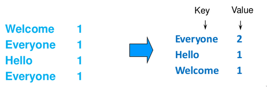
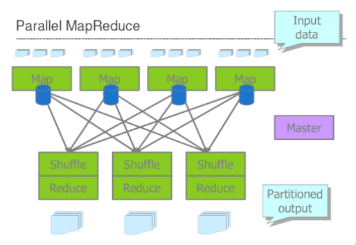
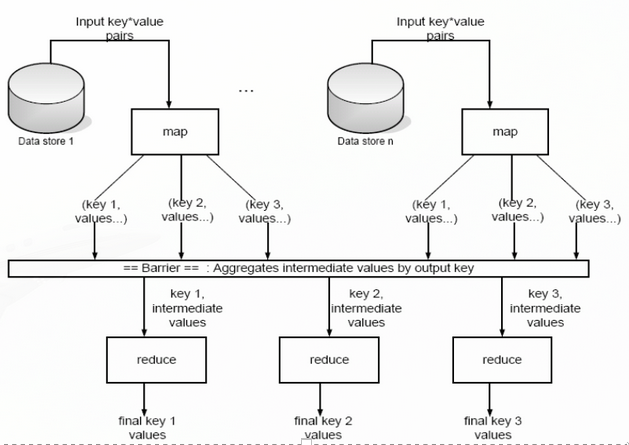
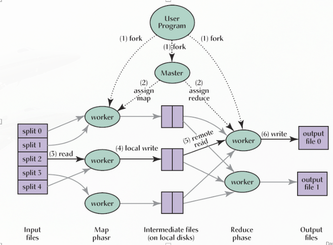
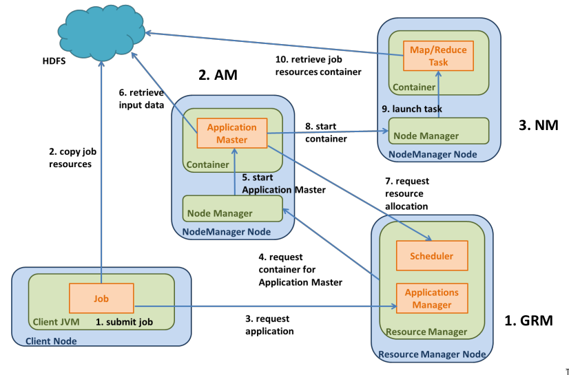
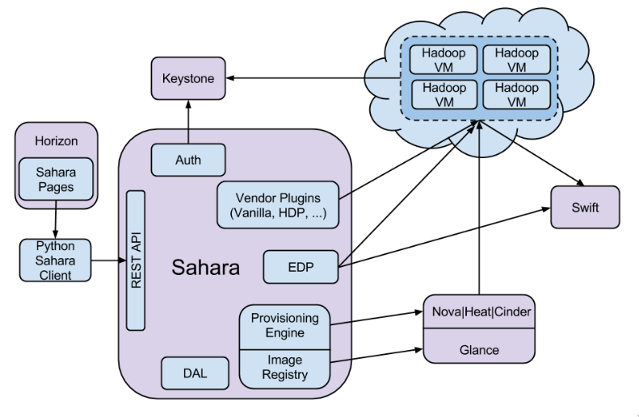
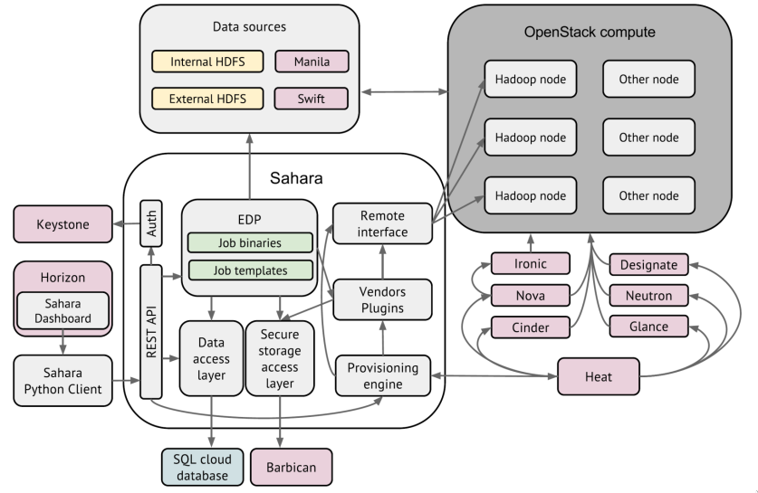

# Analysis of big data

Setting: Lots of data to process. Very common situation, people produce lots of data, the need is to automate the analisys. In Unix a common pattern is **pipelining**, it's effective but the major issues is the **lack of parallelization**.

One solution proposed is Map-reduce, batch programming model published in 2006, born to provide fast results for searchs using a parallel, distributed algorithm on a cluster of machines.

Map reduce: inspired by `map()` and `reduce()` functions used in functional programming, but the key contribuion comes form the scalability and fault-tollerance achieved by parallelization.

Nowdays we reached excellent level of data parallelism, communication overhead is not so significant compared with the overall execution time: access to data and computation time dominates the execution time.

Data access rate can become the bottleneck.

> HPC is not for ITs, is for physics and mathematicians

## HPC context and BSP model

Automatize everything: batch processing must be automatized to reach a widening potential user audiance.

- **BSP, bulk synchronous parallel,** as a way to model easily the internal  execution and the coordination of these processes.
- **HPC, highly parallel computing,** maked large use of **special purpose languages**, to solve parallelism, The solution pattern is to give a **simplified control** of several **processes in parallel** at the same time. (*very esoteric*)

## Map Reduce

MapReduce is a **programming framework** (works with static data in a distributed filesystem) that lets the engineers focus **only on the application logic**, without dealing with scheduling, fault-tolerancce and synchronization.

Since the original MapReduce comes from Google, it works on top of GFS.

It's based on the abstract black box approach: Specify special-purpose behavior in just two steps, defining the complementary operations of *map and reduce*. Programmers with no experience in distributed/parallel systems can work with it.

- **Map:** distribution phase and the parallelize decision
  - Input: a list of data and one function
  - Execution: the function is **applied to each** list item
  - Result: **a new list** with all the results of the function
- **Reduce:** : result harvesting phase
  - Input: a list of data and one function
  - Execution: the function **combines/aggregates** the list item
  - Result: one **new final item**

Two phases, two function, the rest is transparent.

### Example: word count

- Map: creates a key-value store with the key as a word and as value just the number 1.
- Reduce: Takes the key-value store and aggregates (combines) the same key entry summing the values together.

### Example: reverse web-link graph

- Map: emits `(target, source)` pairs for each link to a target URL found in a source file
- Reduce: emits paurs (target, list(sources))

During the execution how many processes I need? If I use 4 processes, data are split in 4 parts.

Shouldn't go go too small splitting, overhead cost of generating processes.

In system input/output is the bottleneck, but also the barrier: what if the answer is failing? what if answers are not synchronized?
MapReduce works well is datas are not linked (trees doesn't fit properly).

### Scheduling and execution

Map reduce architecture: one master, many workers.

Different level of parallelism between the 2 phases: M processes for mapping, R reduce processes. Processes are assigned to workers dynamically. ex: $M=400,000$, $R=4000$, $workers=2000$.
Master assigns each map task to a free worker:

- consider locality of input data to a worker.
- Output intermediate key/value pairs written to local disk, divided in $R regions$. and the locations of the regions are passed to the master.

Master assigns each refuce task to a free worker: each output sotred in GFS.

Quality in MapReduce:

- Master failure: master is SpoF, state os checkpointed to GFS: new master recovers and continues
- Worker failure: master detects failure via periodic heartbeats
- **Map tasks**: completed and in-progess on the node should be **re-executed**. (Values saved on local disk)
- **Reduce tasks:** only in progress reduce tasks whould be re-executed (results saved on GFS)

**Robusteness:** active replication not coordinated.

**Problem**: stragglers, slow workers in finishing.

**Solution**: Close to completion, spawn backup copies of the remaining in-progess tasks: whichever one finishes first wins

- Addiotional cost: few percent more usage
- Result: a sort program without backup was $44\%$ longer. (in some subset of inputs there could be more dense entries)

## Apache Hadoop

Apache Hadoop is the MapReduce framework written in java by Apache. Has in itself several subprojects:

- Destributed file system (HDFS)
- MapReduce
- YARN: yet another resource negotiator for cluster resource management

YARN provides management for virtual Hadoop clusters over a large physical cluster

- Node allocation
- Starts Map/Reduce and HDFS workers
- Includes management and monitoring

Other resource managers are available, such Apache Mesos, since Yarn is used underneath Hadoop since 2.x. Yarn treats each server as a collection of containers, each has a fixed CPU and fixed Memory.

### Apache Sahara

Apache Sahara is the deployment of Hadoop for Openstack. Sahara service can allow deploying and configuring hadoop clustes in a cloud environment by adding services:

- Cluster scaling functions
- Analytics as a Service (AaaS) functions

> What is the advantage of using Openstack instead of Google? Openstack is agnostic of implementation, can work with serveral vendros: It's a free connector with other solutions. Some parts od opestack communicate with MOM, so you can change them easily

## Apache Spark

Not a modified version of Hadoop, but a separate, fast, MapReduce-like engine: **new optimized version of Hadoop**.

- in-memory data storage, fast queries
- General execution of graphs and powerfull optimizations
- Super faster than Hadoop
- compatible with Hadoop storage API
- **not tied to a specific language** (Important bc the Professor hates Java)

### Spark basics

Batch/streaming analysis, interactive queries and iterative algorithms. Supports several storage options and streaming inputs for parsing.

When MapReduce became popular, people asked for more than its semplicity:

- More Complex, multistage applications (interactive graph algorithms and machine learning)
- More interactive ad-hoc queries

Multi-stage and interactive apps require **faster data sharing** across parallel jobs: **Resilient Distributed Datasets in memory, RDDs**.

- Removes the MapReduce overhead of writing intermediate results on disk
- Fault-tolerance is still achieved through the concept of **lineage**
