# Cloud Support and Global Strategies

## Coud data center

The cloud means a big data cneter, federated with others capable of giving good and fast answers to user.

Requirements of a DC:

- Fast answers to users
- Correct & safe answers

Users want also:

- Real-time in answering
- Safety of data in the architecture

Giving fast answers is difficult if the system works synchronously with subservices: waiting for slow services mith many updates forces to defer the confermation and worsening the service time.

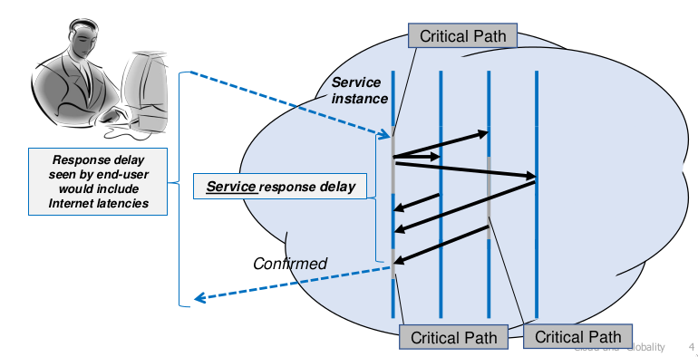

Fast aswers can stem (??) from replicas and parallelism: read operation in parallel.

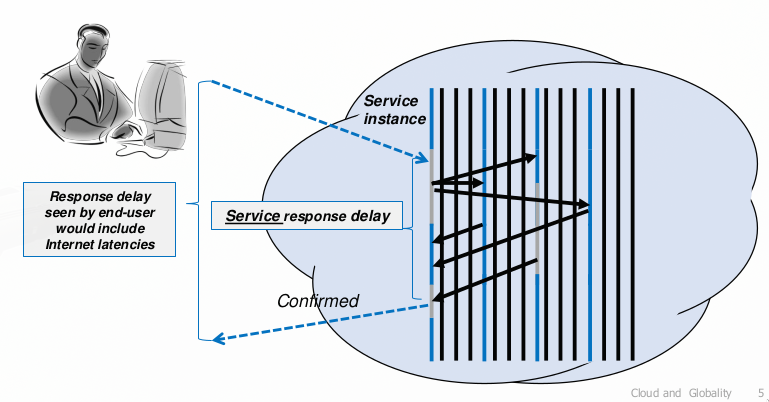

### Architecture of a cloud DC

Two levels of service in a two-level architecture:

- the first level is the one interacting with users. Gives fast and prompt answers.
- the second level keeps the deep data and their correct and persist value.

### Level 1: Cloud Edge

**Cloud Edge:** The layer 1 of the cloud is the layer very close to the client in charge of the **fast answer to users** needs. Many possible users, even **concurrent**: reads are no problem, writes and updates may arise problems.

**Guessing Model:** try to forecast the update outcome and answer fast, but then operate in background with the level 2 to reach consistency.

### Level 2: Cloud Internal

Responsible for stable answers, it is not accessible to users, only from layer 1.

Layer 2 is in charge of replicating data and keeping caches, replication for fault tolerance and caching for fast answers.

Replication policies: doenst require replication of everything, but only some significant parts: **shards**.

### Two level replication

- Level 1: replication tailored om user needs, to match requested SLA
- Level 2: support user-long term strategies, optimizes data in term of smaller pieces, called shards.

Any level uses dynamic replication.

### Level 1: replication

Users expect a good support for their needs:

- Processing: an abstraction of at least one dedicated server activity.
- Data: copies of data give efficient and prompt answers.
- Management: must be capable of controlling resources in a previously negotiated way, toward the correct SLA.

Replication is transparent

### Level 2: replication

It is separated as much as possible from the level 1. **Replication** here is in the use **of fast caches** that separate the two levels and **make possible internal deep independent policies**.

Uses replication driven by the whole load of the system and less dependent on single user requirements.

Nothing is completely and fully replicated: cloud identifies shards, small enough not to clog the system and changing based on user dynamic needs.

### Cloud shards

The definition of smaller contents for data replication. Shards allow high availability and increase performances. Shards existes because is not possible to replicate data entirely and have several copies (too expensive).

Shards properties

- dynamically decided
- unit of data to be operated upon which maintain consistency
- not too small to avoid fragmentation
- must not be too large, would be difficult to maintain the coordination

Shards can be local or can be coordinated with other DCs to grant consistency.

### Cloud Asynchronous effects

Answers are given back when the level 2 has not completed the actions (write actions) and those actions can fail:

- if level 2 replicas are not scheduled all the same, their final state can be different
- Results cannot be granted (specially is the leader fails)

Some agreement between different copies must be achieved at level 2 (eventually). All the inconsistency of the modeal clashes with safety and correctness.

Inconsistency is not a real problem most of the time: many cases users don't need a real answer but an approximation of it.

## CAP Theorem

> "You can have just two from the three properties: consistency, availability, participation tolerance"
> Eric Brewer

Cloud reject consistency to achieve partitioning and availability (fast answers), **AP**.

### Consistency: two perspective

Pessimist:
> "You know you have one problem when the crash of a computer you have necer heard of stops you from getting any work done" Lamport

Optimist: A distributed system is a collection of indipendent computers that appears to its users as a single coherent system.

#### Acid

Acid reaches the maximum of consistency:

- atomicity: all operation of the transaction are properly reflected in the databases or none of them (commit/abort)
- consistency: if DB is consistent before a transaction, it must be also afterwards
- Isolation: hide all the concurrency. All middle steps of a transaction is visible only at user that launched.
- Durability: once a transaction commitsm updates can't be lost, not their effects rolled back.

If two transactions tends to conflict above the same replica the final state is not agreed and nodes need forced reconciliation, scalability in this case is terrible.

The cost of transactional ACID model on repllicated global data is surprisingly high. Solution can involve ad-hoc tensactions and sharding.

#### Base

> "You can't use transactions at large scale in the cloud" Brewer

The real issues are mostly in the highly scalable and elastic outer tier (stateless), close to the users and does not impact on the second inner layer.

Cloud systems use transaction all the time, but they do so in the "back end", they hide it as much as possible to users. This is to avoid overload and not to create bottlenecks.

**BASE: Basically Available**. The goal is to provide fast responses even id replicas are slow or crashed. In case of partition faults isolated machines are rebooted.

**Soft State Service**: runs in first tier and are stateless. Every restart is to a clean state.

To maintain data:

- replicate in memory in enough copies to never lose all in any crash
- Pass it to some other service that keeps "hard state"

**Eventual Consistency**: Shorten return path by send optimistic answers to the external client.

- cached data (without checking for statelessy)
- Guessing outcomes of updates
- Skip locks, hoping that no coflicts will happen (**optimisitc approach**)
- correct any inconsistency with **offline cleanup activity**

#### Implementation

Use of fragmented transactions: steps that can be done in parallel as much as possible. Each step could be triggerd with a single event deliverd by a multicast.

The transaction leader stores these events in a MOM middleware. The idea is sending the reply to the user before finishing the operation.
User side client should hide visible asynchronous side effects.

With BASE:

- Fast concurrent code
- Eliminate locking with early responses
- Looking close we can see weird behaviour
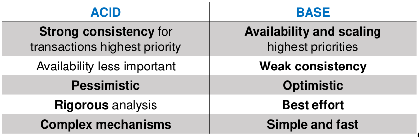

### Consistency and availability

No partitioning, when a partition occurs no work can go on and the reconnection must be awaited. examples:

- Single-site and clustered databases
- Orher cluster-based designs

Typical Features:

- Two-phase commit
- Cache invalidation protocols
- Classic DB style

#### Nested Transaction and 2PC

**Transactions** in a distributed system is definition of a context of coordination of several points that must act on data in a agreed way - **either all the change must be taken or nothing must occur**.

In distributed systems you may also have one transaction containing other ones, in different levels of nesting. Effects are visibile only when the whole has been agreed and eventually committed. **Two phase commit** is the typical protocol to obtain ACID quality for transactions.

One manager commands the ACID behavior and the salve must obey so to agere on the result (errors and misbehaviors can occurs).

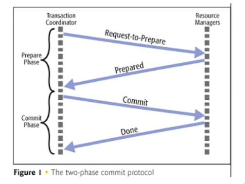

One manager decides all-or-nothing:


If more managers work on the same data at the same time one of the two must abort.

Two Phase commits uses $4(N-1)$ messages.

### Eventual consistency

You can work in case of a partition and still give answers, then you will grant reconciliation afterwards. ex: DNS

#### Several kind of consistency

- **Strict**: updates must happen instantly everywhere. Read returns last write
- **Linearizable**: updates appear to happen instantaneously at some point in time. Operations ordered by a global clock.
- **Sequential**: Every client see its writes in the same order.  Order of writes from the different clients is not preserved. **Equals to Atomicity+Consistency+Isolation**
- **Eventual**: when all updating stops, then eventually all replicas will converge to the identical values. Equivalent to CAP.

#### eventual consistency implementation

Write propagation to replicas can be **implemented with two steps**.
Writes, when they arrive, are appendend to a log and applied in the same order at all replicas (with timestamp and "undoing")

Update propagation in two phases:

1. **Epidemic stage**: **final local propagation**. Spread an update quickly willing to tolerate incomplete coverage for reduced traffic overhead.
2. **Correcting omission**: a final phase to grant that all replicas that were not updated during the first stage get the update.

The most appropriate approach to reconciliation depends on the application. A widespread approach  is "last writer wins". Another is to invoke user-specified conflict handler. Timestamps and vector clock are often used to detect concurrent updates. Some people use "first writer wins" in situations where "last writer wins" is unacceptable.
Reconciliation of concurrent writes must occur sometime before the next read, and can be scheduled at different instants:

- Read repair: the correction is done when a read finds an inconsistency. Slows the read operation.
- Write repair: the correction takes place during a write operation, slowing down the write operation.
- Asynchronous repair: the correction is not part of a read or a write.
[1](https://en.wikipedia.org/wiki/Eventual_consistency)

## 5 commandments of distributed systems

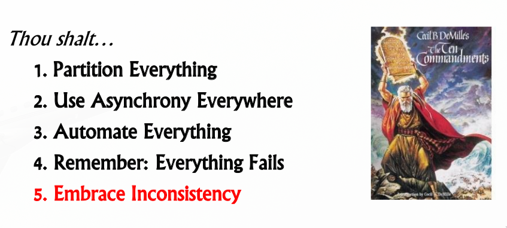

The final point is releasing consistency, depending on application areas, looking at consistency as a spectrum and not a specific position.
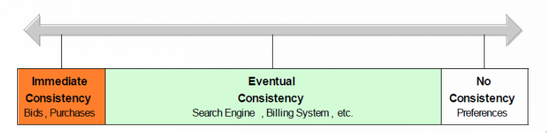

### 1 Partition Everything

Pattern: **Functional Segmentation**

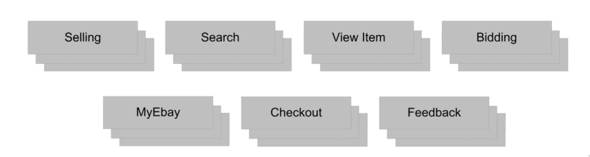

- You should split anything you can in separeted localities
- No large components (to be kept consistent)

Pattern: **Horizontal Split**. Load balance processing: all servers are created equals within a pool. Split data (shards) along primary access path. Partition by range, modulo of one key, lookup, etc.. in the data access layer.

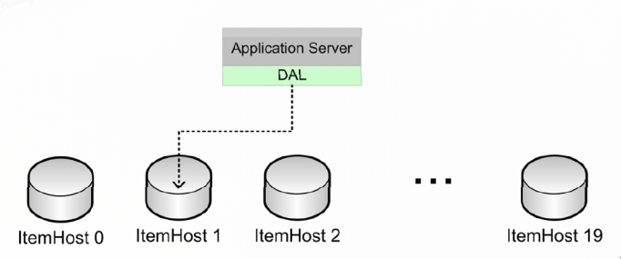

**Corollary:** No DB transaction.

- Absolutely no Client-Server transactions, 2PC, ecc...
- Auto-commit for vast majority of DB writes
- Consistency is not always required

### 2 Asynchrony Everything

Prefer asynchronous processing. Move as possible to asynchronous flows where possible, integrate disparate components asynchronously.
<!-- Requirements: -->
<!-- - Scalability: can scale components independently
- Availability: can decouple availability state and retry operation
- Latency: can significantly improve **user experience latency** at cost of data/execution latency.
- Cost: can spread peak load over time -->

Pattern: **Event Queue or Streams decoupling**

Primary use-case produces event transactionally such as

```text
Create event(ITEM.NEW, ITEM.SOLD)
```

With primary insert/update. **Consumers subscribe to events**, at least once delivery, no guaranteed order with idempotency and readback.

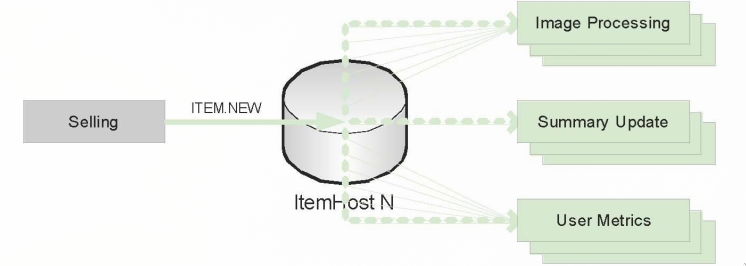

Pattern: **Message Multicast**

Search Feeder publishes item updates, by reading item updates from primary database, and it publishes sequenced updates via **scalable reliable multicast** - inspired protocol.

Nodes listen to assigned subset of messages

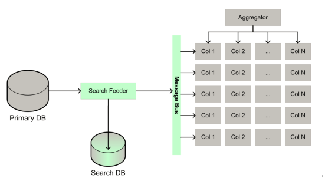

Pattern: **Periodic Batch**. Scheduled offline barch process.

Most appropriate for: Infrequent, priodic, or scheduled processing (once per day,week,....), Non incremental computation (no "FullTable Scan").

Examples:

- Import third-party data (catalogs, currency, ecc)
- Generate recommendation (items, products, searches)
- Process items at end of auction

Often drives further downstream processing through **Message Dispatch**

### 3 Automate Everything

Prefer adaptive / automated systems:
 -Costs machines are far less expesive than humans and it is easy to learn/improve over timewithout manual effot.

- Automation patterns
- adaptive configuration
- machine learning
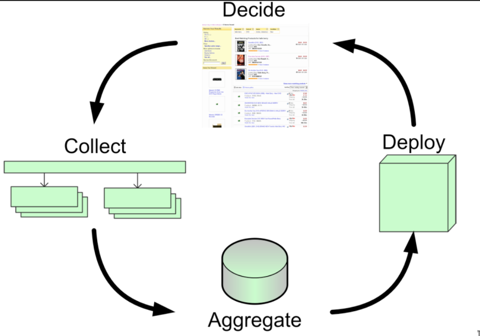

Pattern: adaptive configuration. Define a SLA for a given logical consumer. Dynamically adjust configuration to meet defined SLA.

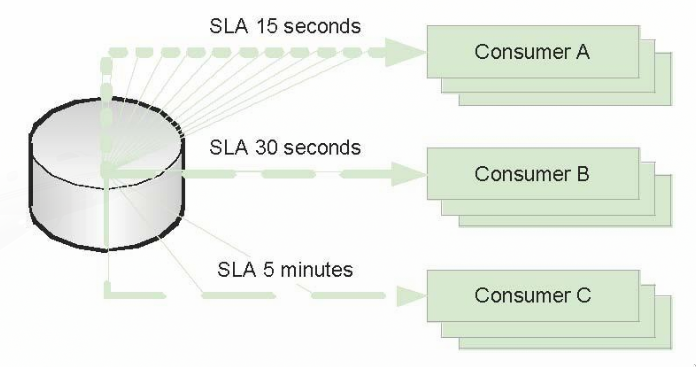

Pattern: machine learning.

- Dynamically adapt search experience.
- Feedback loop enables system to learn and improve over time.
- Perturbation and dampening

### 4 Everything Falls

Pattern: **Failure detection**. Servers Log all requests. Listeners automate filure detection and notification.

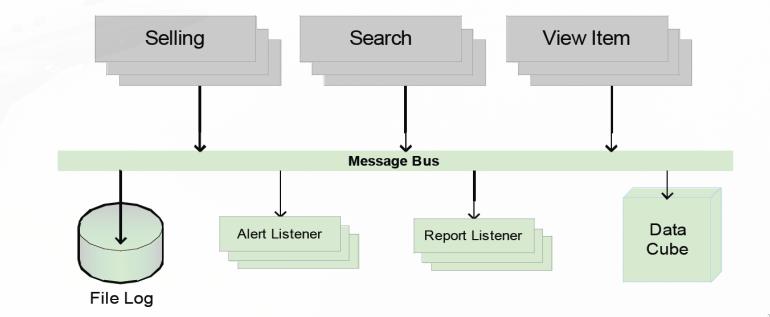

Pattern: **Rollback**. Absolutely no changes to the site that cannot be undone. The system doesn't take action in case irreversible actions are to be taken. Every feature has on/off state driven by central configuration.

Pattern: **Graceful degradation**. Application "marks down" an unavailable or distressed resource.

- Non-critical functionality is removed or ignored.
- Critical functionality is retried or deferred.

### 5 Embrace Inconsistency

Choose Appropriate consistency guarantees

- According with Brewer's CAP theorem, prefer eventual consistency.
- To guarantee availability and partition tolerance, **we trade off immediate consistency.**

Avoid distributed transaction:

- **minimize consistency** through asynchronous event or reconciliation batch
- **minimize inconsistency** through state machines and careful ordering of operations
