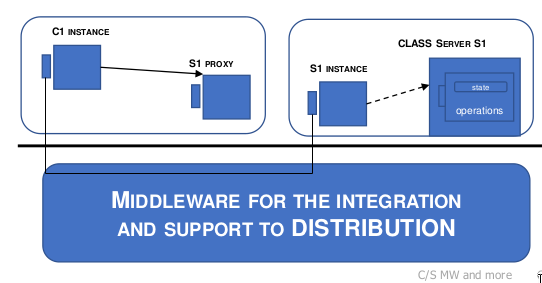
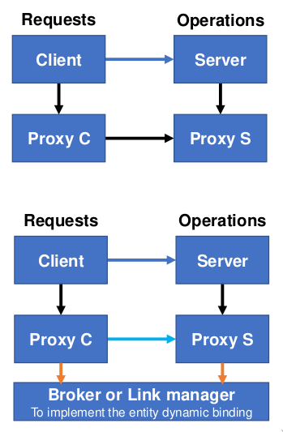
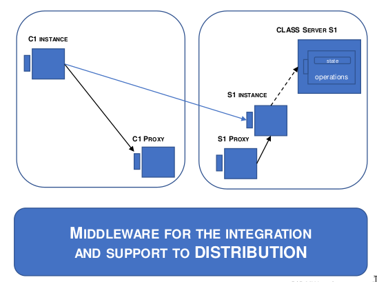
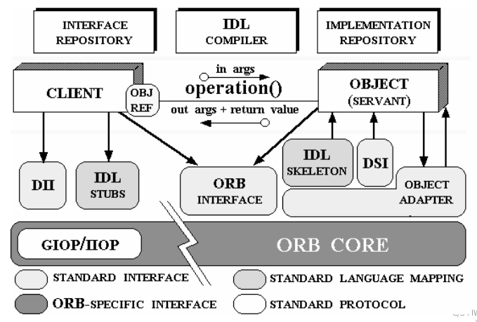
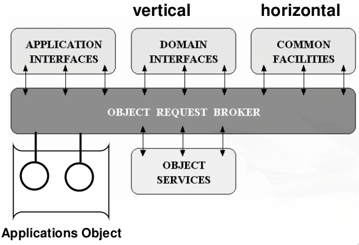
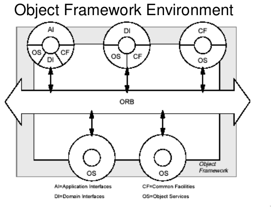
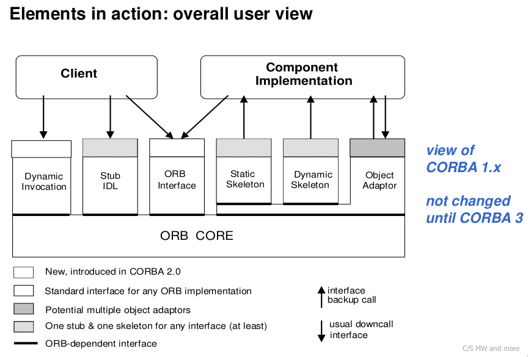

# Corba and Mom

### two models of communication:

Client/server vs Message exchange: led the design of all distributed system.
Main difference based on the relationship between entities and their interconnection.
*Sticking to point-to-point*: 

| possible features |                                  |
| ----------------- | -------------------------------- |
| synchronous       | there is a result from receiver  |
| asynchronous      | there is NO result from receiver |
| blocking          | sender waits for result          |
| non blocking      | sender does not wait for result  |

### C/S VS MESSAGE EXCHANGEb

Differences between default Properties:

| client server   | message passing    |
| --------------- | ------------------ |
| synchronous     | asynchronous       |
| direct          | indirect           |
| blocking        | non blocking       |
| single receiver | multiple receivers |

#### Client/Server:

- strong coupling
- co-presence of interacting parties
- High-level and simple communication
- not so flexible
- **no multicast MX** and **no broadcast BX**

#### Sender/receiver message exchange:

- minimal coupling
- no co-presence of interacting parties
- not easy to use, low level
- differentiated modes of usage
- any form of **MX and BX** 

### COMMUNICATIONS ENABLER

Capacity of the initiator of the actions to identify the possible partner in the communication. Must be **some non-local identifier** to refer to some remote entities. Usually provided by a **middle-ware with a name server service**, that will give a remote reference.

#### C/S - REMOTE REFERENCES

We need some intermediary support that extends the visibility to remote nodes.
Implemented via local intermediaries (proxies), **support transparency**.



#### intermediaries and proxies

- proxy: c/s stub and skeleton
- interceptor: add functions
- broker: dynamic binding



#### RMI REMOTE REFERENCES

Java remote method invocation (RMI) build two proxies:

- one from the customer (stub)
- one for the servant (skeleton)
  Such proxies are often generated automatically and make the user part reasoning **regardless of the specific deployments**



About remote references:

- two references to the same object?
- two references for the same service?

#### INTEGRATING DIFFERENT SYSTEMS

main challenge is to get over different heterogeneous environment:
one middleware capable of making anyone communicating to any other one

## MIDDLEWARES: CORBA****

**STANDARD OPEN SYSTEM based on OBJECTS**. Every Corba implementation is compatible with the others.

Interaction and integration between components that are: 

- heterogeneous (different languages)  
- object oriented
- distributed
  In order to do that corba needs:
- **IDL**: interface definition language
- support to object interaction
- integration bus for different environment **orb**
- **mapping on different languages**
- interaction between different managers (different corba system)

### Corba architecture

Common Object Request Broker Architecture = CORBA


#### Object reference

Object Reference (Obj Ref) as an handle for the service provided by one of servants. Corba is a **Object management architecture, OMA**.

#### ORB

**Object Request Broker (ORB)** is the heart of the architecture, acts as a **broker of communication**. Allows static and dynamic links.
**ORB controls**: 

- allocation and visibility
- methods and of communication
- accessory services
- simplified management

Corba is long lifetime and ORB is the **naif enabler**.

ORB is a **bus center** of the architecture, integrates every resources of the organization. **Each application/object** can belong to different environments and can **mutually communicate without redesign**.

#### Object management architecture



- **common facilities CF (horizontal)**:
  - specific features
  - user interface (client side)
  - system management, information, task (sever side)
- **domain interfaces DI (vertical)**: domain specific interfaces, base services common to the every application in the domain
- **Application interface**: specific interfaces for the single application in the domain.
  The application can use the domain interfaces in order to reduce code duplication.

#### Objects in corba

An **object**:

- is a server implementing a specific interface. **Many servers** can implement the same interface
- is a client asking for services

Users (clients) do not control which of the servers answers, to be independent from the specific server the client uses a **remote reference** (Object reference), but asks for an interface that represent a service.

Since the system is heavy in implementation **you need to define a methods coarse to be sustainable**



### Corba Requests

The ObjRef embeds (the type of) the interface you need and the same is for the arguments/parameters. Think to a method request in some neutral language.

**General language:** Args can be **in, out and in/out**

``Result= ObjRef.method1 (in a1, out a2, in out a3, …, in out aN)``

Every component can connect to every other one, preparing links either **before or during** the execution, **by one or more ORB** (known only dynamically).

#### Additional components

- discovery of the interfaces

- Corba Services (common mw services)
  
  - Naming and trading service (compatible with OO)
    
    - **naming**: get an ObjRef from the interface you want - <mark>white pages</mark>
    
    - **trading**:  provides all the interfaces by querying for one/more attributes - <mark>yellow pages</mark>
  
  - Event and notification service (less OO): CORBA is <mark>strongly synchronous mainly blocking</mark>, users can find useful also more **asynchronous strategies**. Can define events and services for handling them.

#### Essential components

- Object Request Broker (ORB)
- Interface Definition Language (IDL)
- basic Object Adapter (e POA …) (BOA & POA)
- Static Invocation Interface (SII)
- Dynamic Invocation Interface (DII)
- Interface Repository & Implementation Repository(IR & IMR)
- Integration Protocols (GIOP)

*(These components are at different levels)*

#### Corba continuous support

Orb coordinate invocation of local and remote services (dynamically)

- object location

- object creation, activation and management 

- transfer the request <mark>(via an adapter)</mark>

- return the reply



#### Common language in Corba - IDL

Must identify and coordinate requested and offered services, local and remote:

- **Servants and clients are mutually known** 

- Operations requests and service offers can be **optimally associated**

- Corba's IDL is a **general multi-language IDL**

IDL prescribes predetermined identification, **CORBA static BINDING**. 

#### CORBA IDL FOR MULTILANGUAGE

```
interface Factory //OMG IDL
{
    Object create(); // CORBA object or reference
};
```

> This interface permits to refer an object of type Factory (IDL) and to request the create operation (without in or out parameters) that returns a generic CORBA object (type Object, that is a reference to the object of interface Object)

IDL makes possible to define new interfaces, new general types and also **local corba support objects**, also knows as **pseudo-objects**

> :warning: ***CORBA does not provide any object creation***

IDL allows to generate support proxy components (*stub and skeleton*), in different languages (**data presentation**)

- stub: message from the client perspective (marshaling) and acting as client proxy

- skeleton: collaborates with the ORB accepting service requests
  and adapting them to the server (unmarshaling)

#### Deployment

There is a **static link** between interface - client - servant: not between client and servant, but **client-service** and **service-servant**. 

> :warning: The objects inside their different language environments are bound to the stub and skeleton before execution.

> :exclamation: (stub and skeleton are CORBA objects? **NO, they are local
> support components**)

#### Corba Adapter

System component to **overcome at run time heterogeneity** and differences among implementation of **different service environments of different servants**. 

:warning: **The adapter doesn't connect with data presentation**

- Object activation and registration

- External reference generation

- **request demultiplexing** and **send requests**

- Collaborate with skeleton to invoke operations

First adapters where Basic (BOA) and Portable (POA). 

> POA is a pseudo-objects. BOA is not, it was just an non-standardized attempt.

> *The POA allows programmers to construct servants that are portable between different ORB implementations. Portability is achieved by standardizing the skeletons classes produced by the IDL compiler, as well as the interactions between the servants and the Object Adapter* [1](https://www.dre.vanderbilt.edu/~schmidt/PDF/POA.pdf)

#### Interface repository IR

allows to know details about every IDL data type and to explore interfaces available during execution. **not name server**.

**language mapping**: The interfaces are translated to different programming languages (**static binding**) where components are defined.

Allows to use available interfaces dynamically and decide at runtime which is convenient and available (**dynamic binding**).

> overcoming static approach: gateway that allows access to CORBA interfaces of an environment and cannot be recompiled for every new interface

IR service description system (it is not a naming system). IR is an Object.

#### ORB and IR

ORB is the core enabler of any (remote) execution and operation request between different entities. Every request is always delivered via the ORB. The ORB does not know about any type information. 
