# Docker

## Software deployment problems

- Process Isolation
- Process Management
- Process Packing
- Reproducible Environment

### Process Isolation

a process is the representation of a running program. Unix isolate by default memory space and file system. But it's not enough. We need to isolate also network, users, and other resources. Linux Kernel introduces "**namespaces** to .

- Linux namespace: `man 7 namespaces`
    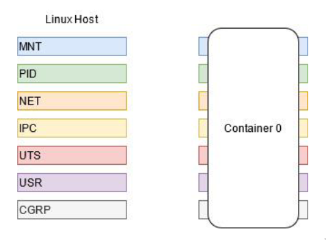
  - MNT mount points
  - PID process IDs
  - NET network devices, stacks, ports
  - IPC message queues, semaphores, shared memory
  - UTS hostname and NIS domain name
  - USR users and group IDs
  - CRGP resources quotas
    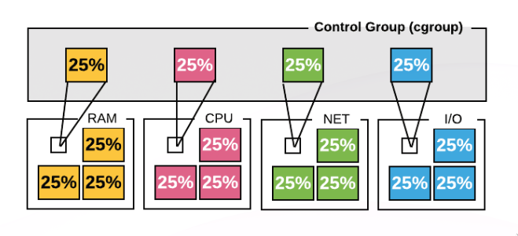

  Namespaces can be isolated or shared among different containers. Usually can be used to forge networks inside a physical node.
  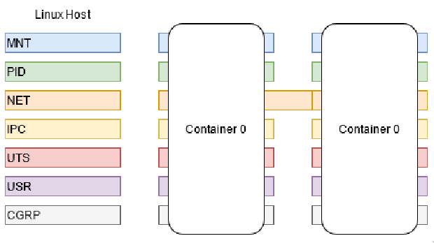

## Docker Platform

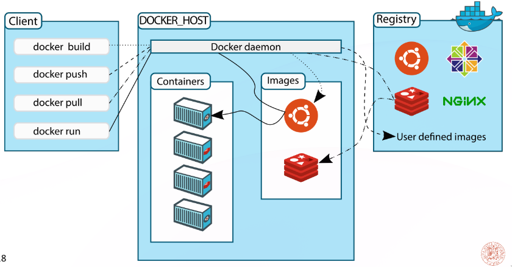

Docker is a container engine that enables configuration, deployment and lifecycle management.

### Lifecycle management

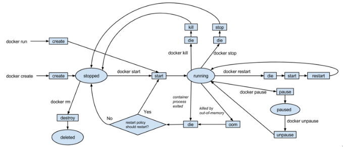

### dockerfile

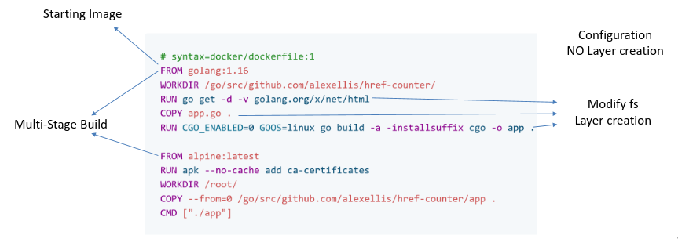

Dockerfiles are used testing and building of docker images. A Dockerfile is useful to define needed dependencies and how to prepare the system for execution (like provisioning, but this should bring to an executable image).

### Docker Images

One of the major properties about docker images is the **immutability and reproducibility**.
A docker image is built modifying a base image with a Dockerfile. Each modification is a layer. The final image is the sum of all layers,  it is a read-write filesystem. **Each layer** is a set of changes to the filesystem, and **gets a unique ID**, that is used to **reference** the layer. A layer can be cahed and reused on different buildings.
**A layer should be stateless** to have reproducible effect on different builds. Do not do:

```Dockerfile
RUN apt-get update
RUN apt-get install -y packet-xyz
```

But:

```Dockerfile
RUN apt-get update && apt-get install -y packet-xyz
```

`apt-get install packet-xyz` is a statefull operation, it depends on the state of the previous layer. If the system is not updated the installation could fail or install an old version of the packet.

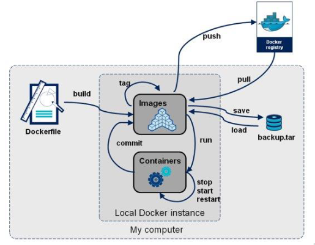

The final image has his own hash, which is the concatenation of the layer's hashes making it immutable and reproducible by design.

### Networks

- Bridge: it's a bridge between different containers. Each has an IP.
- Host: remove network isolation between the container and the docker host. (From the outside the container is an app)
- Overlay: Run multiple virtualized network layers on top of the physical net.
- Macvlan: assign a mac address to a container, making it appear as a physical device
- None
- External Plugin: use third part network plugins

### Docker Compose

Handy tool to define distributed application based on docker images (already builed). It was used in production, but is now confined to the testing and development phases.
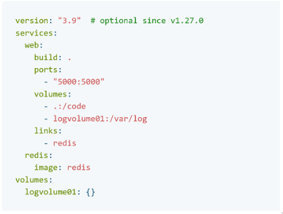

## Cloud computing definition

Cloud computing are computational resources (virtual) accessible via the internet. It's a pay-per-use model, where the user pays only for the resources used. The cloud provider is responsible for the infrastructure, the user for the application.

The main goal of the cloud infrastructure management is to understand how to effiently allocate resources in the data center. The cloud provider should be able to provide the right amount of resources to the user, without overprovisioning or underprovisioning.

The user should be able to **scale the resources** up and down, **depending on the workload**, in a **cost-effective way**.

### Kubernetes (k8s)

Kubernetes is a container orchestration platform: it **manages the lifecycle** of the containers, scaling, networking, and storage. It uses a **declarative model** to define the desired state of the system.

features:

- multicontainer app deployment
- scaling dynamically
- self-healing
- rolling updates and rollbacks with zero downtime
- independency from the underlying infrastructure
- discovery service

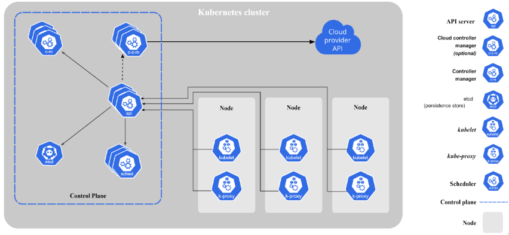
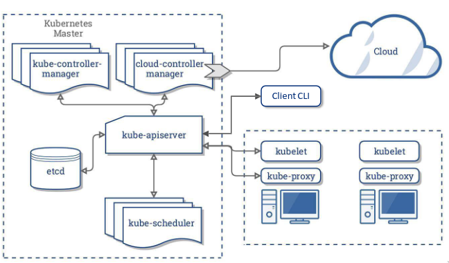

Master/Worker architecture. The master is the control plane, the workers are in the data plane. Each component is stateless and can be replicated, except for the **etcd**.

### Etcd

Etcd is a strongly consistent, distributed key-value store that provides a reliable way to store data
that needs to be accessed by a distributed system or cluster of machines. It handles the coordination of the cluster and stores the state of the cluster. In case of network partition it uses the **Raft consensus algorithm** to reach a consensus and elect a new leader.
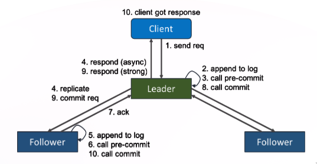

### Kubernetes Controller-Manager

It's a daemon that embeds **the core control loops** shipped with Kubernetes.

It watches the state of the cluster and makes changes to the desired state. In the controller manager there are different controller: Endpoint controller, namespace controller, service account controller, replication controller.

### Cloud controller manager

It embeds the cloud-specific control loops. It allows the cloud provider to release functions in a decoupled way. It is structured using a plug-in mechanism.

### Kubelet

Primary node agent that runs on each node. It is configured with a **Podspec** : a yaml or json file that describes it. Generally the podspec is provided by the apiserver. the kublet makes sure that the containers described in the configuration files are running healthy.

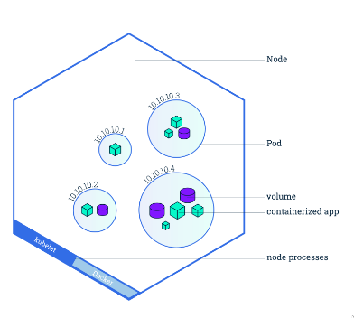

### Pod

A pod represent a group of one or more application containers, and some shared resources:

- shared storage as volume
- networking
- ...

A pod models an application-specific "logical host" and can contain different application containers which are relatively tightly coupled.

Containers in a pod have same IP. They can communicate with each other using localhost.

Pods are created from *Deployments* definition. Pods are tied to the node where they are scheduled, if the node fails the pod is lost and rescheduled on other available nodes.

### service  

A service is an abstraction that defines a logical set of pods and a policy by which to access them. It is a stable endpoint to access the pods. It can be accessed by other pods or external users.
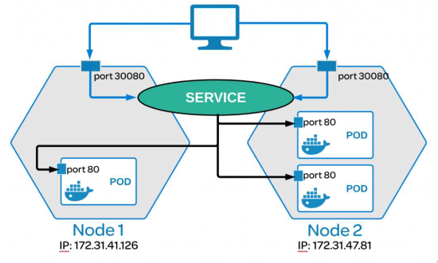

### kube-proxy

kube-proxy is a network proxy that runs on each node in the cluster. It maintains network rules on nodes. These network rules allow network communication to the pods from network sessions inside or outside of the cluster.

To configure a proxy the user must create a service. The service is a logical set of pods that can be accessed by a network session.

### scheduler

Whatces for newly created pods. Assigns a feasible node to the pod. No feasible node means the pod reamains un-scheduled.
when a pod is scheduled the scheduler notifies the ApiServer, `binding` the pod to the node.

### Volume

- ephemeral volume: the volume is deleted when the pod is deleted
- persistent volume: the volume is not deleted when the pod is deleted  

### deployment

A deployment is a higher-level concept that manages **replicas** of a pod. It provides declarative updates to pods and replica sets. A deployment allows you to describe an application's life cycle, such as which images to use for the app, the number of pods, and how to update them.

### Control loop

A control loop is a process that watches the state of the system and makes changes to the desired state.
The state is kept in the **etcd**. The goal of the control loop is the eventual consistency of the system.

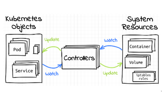

### ETCD

Etcd is strongly consistent, failure tollerant and partition tollerant in a certain level. Etcd is a key-value storage. Etcd is mutable, so introduce inconsistency and scalability problem. To overcome inconsitency due to the distributed nature, **implements the RAFT algorithm**.

ETCD wants to be a CP solution (consitent-partition tollerat):

- Partition tollerance is achieved through passive replication of all the key-value storage in each node. Election leader is regulated under RAFT consensus and happens in these cases:
  - Leader Failure
  - Heartbeat Timeout
- Consistency is achieved with **RAFT consensus**: Leader send an update request and when the majority of replicas responds, the leader send a confirmation back. (not much available). Reads can be linearized (through a quorum) or serialized (local to the node, value might be stale). In case of **missing consensus the Writes and Reads are blocked** (not available).

Etcd requires a number of odd nodes, this avoids cases of split brain in the consensus mechanisms.

**Leader Election**: if a node doesn't receive an heartbeat from the leader (*election timeout*) starts immediately a leader election. The candidate encreases the *term counter*, voting for itself as new leader and sending messages to other nodes for their vote. A node votes only once per term, on a *first come fist served* policy. If the candidate receives a message with an higher term inside it means it has been defeated. If a server receives the majority of answers it becomes the leader. To solve fast the election, **RAFT uses a randomized *election timeout***: nodes rarely become candidates together, this avoids cases of split vote.
