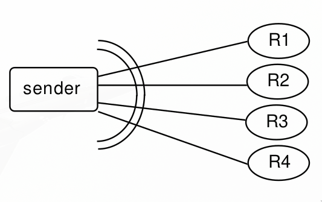
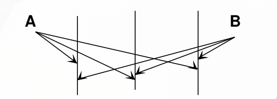
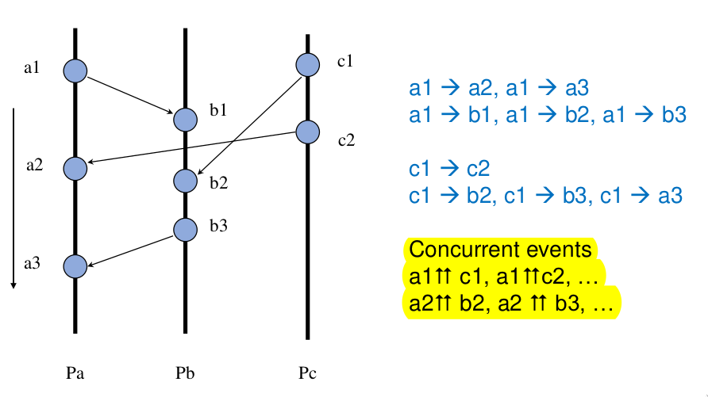

# Partitioning and Groups

Important aspect: how to partition entities in groups of replicated entities.

- partitioning for scalability
- replication for availability

## Semantics in multiple commmunications

which protocols?

### Multicast semantic

Semantic of sending to many receiver. What does it mean the sending succed:

- One received?
- Most received?
- All received?

Do I have to wait all the acks?

I can have several sender in a group.

What does reliability mean in a mutlicast: in this case means you want to recover omission.

Group memebers reception

- reliable -> guaranteed delivery. (with resending)
- unreliable -> only 1 attempt (chorus), Leaving the duty to the other members of the group to propagate.

**Atomicity**: in the group means that the scheduling/ordering inside the group is the same for all the members.

Essential Element
We must think not only to the semantics of a single action, but
also to message ordering in a multiple action occurrence (and
consider their synchronization):

> If you want the same order in on different nodes, it is very hard and expensive. Not easy to scale. If the copies work autonomously you have a much lower overhead to order, you have only to take care about communication.

#### Reliable Multicast

Can be achived is:

- No sender crash
- No receiver crash
- No message omission

Necessity of fault identification and recovery through monitoring of multicast and group. Extra overhead.

The support introduces:

- **Negative ack**: I dont send any ack, I send only an Ack only when I listen something when something is missing or misplaced.

- **Hold Back**: holds a message until all the previous reached the destination

#### Atomicity vs No ordering

**atomicity**: we focus on the reception order of messages by any alive members of the group.
**No order**: all receivers can present a different ordering in any copy.
No ordering poolicy is very easy to support.

### ordering

- fifo ordering: messages received same order in which are sent from the group.
- cause-effect ordering: **Received in the same order they where caused** (then sended). two different servers send 2 messages, the messages must arrive in the order they where caused.  

> (m1 and m2 from S1), (m3 and m4 from S2), **(m1 causes m3)**. Possible arriving order:
    - (m1 m2 m3 m4)
    - (m1 m3 m2 m4)
    - (m1 m3 m4 m2)
    - NOT m3 m1 m4 m2

#### Atomic ordering

**ATOMIC ordering guarantees that all messages are received in the same order by all group members.**
Impossible to forecast any order, but is important to dinamically agree on one and should be the same for all.
The enforcing of orderings is expensive.

- Minimun cost: no ordering
- Fifo and causal: **Partial orderings**
- Atomic: Total ordering

Atomic ordering can follow anyway a causal and/or fifo policy. Cost for atomic ordering can be very different.

#### Multicast ordering

- FIFO multicast: ordering only from the same sender
- Causal multicast: causal ordering
- **Lamport ordering**

Simple way to implement atomic orderd for messages comiing from the outern: **one node becomes also the entry element, front end**. This solution comes with withdraws:

- SPoF
- Unfair management: outern neighbors can be favored. **Low cost but unfair.**

Alternative: mobile co-ordinator with a **Cirtulating token**

### synchronization

synchronization: Ordering on events. Provide a consistent view of the system to the
entire set of communicating processes.
Synchronization by using PHYSICAL TIME and PHYSICAL CLOCK – typical on one local environment only, **absolutely not feasible on distributed and global system**.
Enter UCT, universal coordinated time. NTP is the synchronization protocol able to achieve an agreement on physical clock. Uses a server hierarchy with a small numbers on level to provide clock with small errors. Still remains **hard to avoid conflicts and clock drifting with limited overhead**.

Several Distributed Synchronization Methods: discrete time and ordering of a event subset:

- Ordering logical time of Lamport
- Token Passing LeLann ring strategy
- Event ordering based on priority

#### Lamport relationship

Only some events are considered in the distributed system.

- Local
- Remote (send / receive events form one process to another)

Lamport considers only _relevant_ events and aims at creating a simple ordering policy.

Consider events caused by a set of processes that communicate through message passing. Lamport wants to capture the cause-effect relationship.

**Heppened Before relationship**:

- If a and b are events of the same process and a occurs before b, then a -> b (local order)
- If a is the sending event in one process and b is the receiving event within another process, then a -> b (communication interprocess)
- If a -> b and b -> c, then a -> c (transitivity)

The relation -> introduce a partial ordering in some systems events and among all events, **it's not a total ordering)**. Two events are concurrent :up_arrow: :up_arrow: if **not a -> b and not b -> a**

We don't assume a unique global clock (global time), but **allow for a set of local clocks (local time).**

We work in an **Asynchronous environment** that makes possible high trasmission delay (very very long, but any lost messages). We need several ordering strategies, also gloabal or total to synchronize. We want **to build a logical time system based on the -> relationship**.

#### Logical Clock

