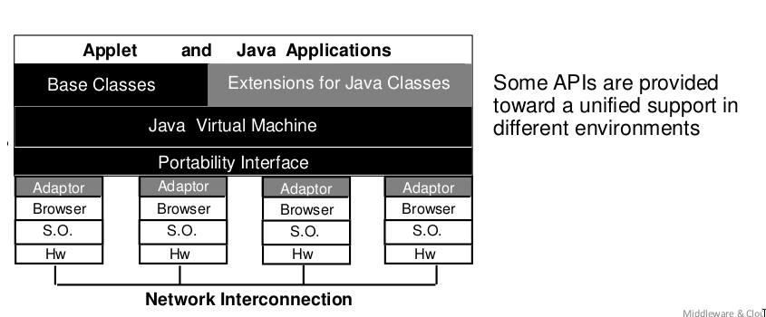
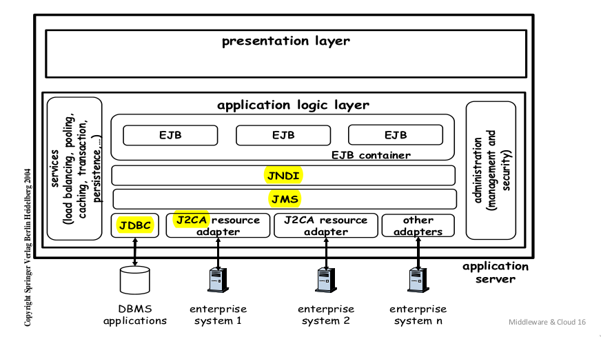
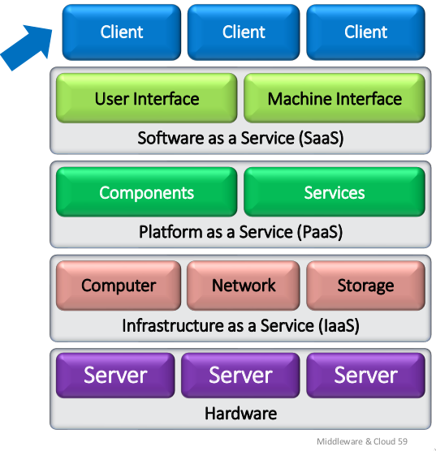
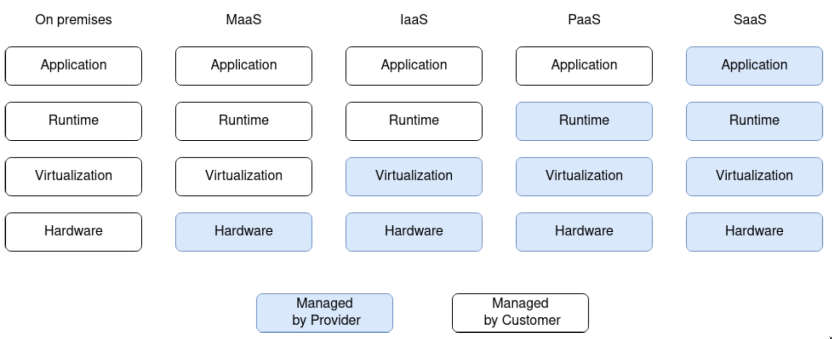
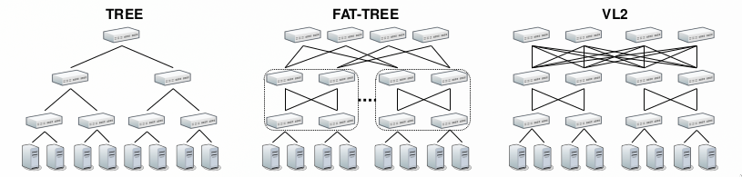
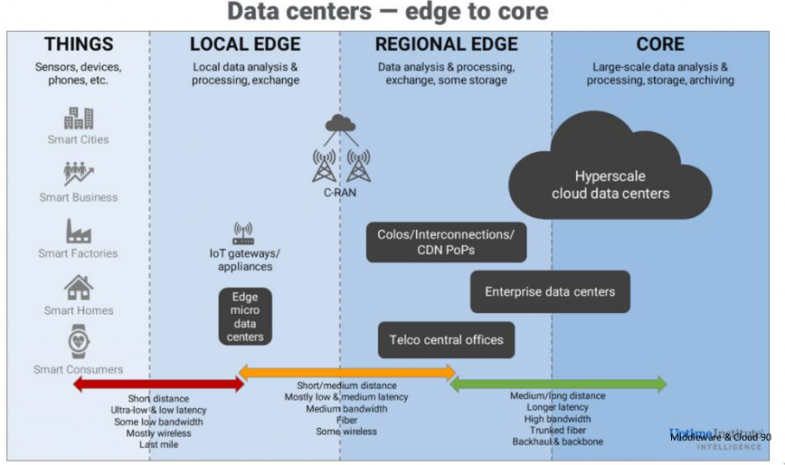

# Middleware

## Intro

Middleware support complex and distributed, deeply heterogeneous systems, goal of providing very differentiated servicies.

Another definition can be:

> Set of tools that allowe to integrate different application and services to be used in _open environment_ (heterogeneously) with an **unlimeted lifecycle**

The middleware should be a layer between applications and hardware: **decoupling layer**, permit a continuos simplified design of any application part, **overcoming the instrinsic heteogeneity**.

The middleware is often invoked and activated in a **trasparent and implicit way**: uniform access API to local geterogeneous local functions:

- Integrate legacy systems

- Used as a standard

Middleware sits on the local operating system:

- Hide physical distribution

- Hide heterogeneity

- Provide common interfaces

- Provide basic services:
  
  - Presentation Manager (gui)
  
  - Computation (parallelization, fast access)
  
  - Communtication (RPC, message queue)
  
  - Control (scheduler, transaction manager)

- Grant avaibility and QoS

## Middleware Layers

### Host infrastructure

Encapsulates and prepares for the common services to support distribution and to ease necessary communication.

### Distribution

This layer provides the programming models for distribution and to ease the applications in configuration and management of distributed resources.

> Ex.: Corba, RMI, RPC, DCOM...

Easier communication and coordination introducing _a resource model, communication APIs, name support, discovery, fast storage, ecc...._

### Common services

Several additional services are available in terms of components that you can add at any time (events handling, access control, logging, streaming...)

### Specific Services

A set of application tools ad services grouped according to specific domains.

> Ex: ad-hoc functions for different areas with very tailored goals: OMG (Object management group), Electronic commerce, Finance.

## Some Middlewares

### Is web a middleware?

Easy reading actions to distributed data and also writing operation, in accessing to a global set of information.
The Web it is not a real middleware even if the most widespread and very legacy now. **Web as a core example because of its extreme diffusion**

### Java's vision: J2EE

Java introduced several layers of middleware: Java Naming & Directory Interface, Java Message Service, J2ee Connector Architecture.

### RPC (... RMI)

Remote Procedure Call as Client/Server tools.

- **IDL**: interface definition language to define contracts.
- **synchronicity**: standard c/s synch
- **Stub**: achieve transparency
- **Binding**: static, not much dynamic

The RPC model is too rigid, not scalable & replicable with QoS.
The server design must be explicit, and any activity provisioning must be explicity defined. **RMI Categorically in-the-small, RPC evolves in the large**

### MOM Middleware

Message exchange between logically separated entities.

- Typed and untyped messages, synchronous and asynchronous.
- Handler(broker) with different stratefies and QoS
- Easy in multicast, broadcast, publish/subscribe
- asynchronous and persistency action

## Object Oriented and Distributed Object Computing (DOC) Middlewares

Data and code distribution via operation requests and replies between clients and remote **servers written in not OO languages**.
DOC uses objects within a framework and a broker as an intermediary for operation object handling.

- the object model simplifies the design
- the broker provides base services and some extra -> **some operations can be automated**
- integration is easier and effective

Implementations can be very **scalable and available**.
Examples: CORBA, COM e .NET, (Java Enterprise)

### Distributed Transaction Processing (TP) Monitor

Declare and support distributed transactions. Optimize db connections hiding applicative decisions to coordinated and transactional access in reading and writing.

- lightweight clients
- ad-hoc languages
- ease in providing ACID
- effiency

### DB middleware

Middleware for integration and eased usage of information stored in heterogeneous and different DBs.
Open DataBase Connectivity ODBC standard **without requiring to modify existing DBs**

### Self-* Middleware

In some cases the visibility of underlying levels can become crucial to reach optimization. With reflection, **policies can change as system components**.
Self-* properties:

- Self-configuration : autonomy
- Self-optimization : social ability and cooperation
- Self-healing : reactivity
- Self-protection : pro-activeness

## Specialized Middlewares

- Middleware to support Real-Time (RT) applications.
- Middleware to support ad-hoc networking
- Middleware to support enterprise interactions
- Middleware to support mobility

### Enterprise Middleware

**Enterprise Application Integration (EAI)**:

- ease the integration across existing enterprise tools
- fast and accurate integration of applications and existing legacy subsystems

## Middleware design - ISSUES

The first issue is the increasing set of functions (objects, resources, etc.) that makes scalability a very tough problem.

- Indirect and dynamic mechanism (interception). Overhead that is unfortunately high and to be minimized
- management cost, increasingly sophisticated tools to be continuously adjusted and updated (monitoring, accounting, security, control)
- mobile and dynamic mobile devices, with need for continuous adaptation to the current context and situation

### Use case

Middlewares propose an architectural model that imply an applicative exploitation and recommended use. It is possible to think of general use cases, but stemming from a clear idea of users and their requirements:

- For a specific application: work in a precise, inflexible and isolated way: low cost and low intrusion requirements

- For applications that have to work in a flexible way: fast integration and eased communication requirements

- represents the organization and requires continuous evaluation: long lifetime
  requirement (possibly infinite life cycle)

### Minimum cost Middleware

Drives the configuration of an application, according to an internal interaction model, **without dynamic scenarios**.  Obtain the functionality of an application in a closed way and with **no changes with Mw services at very low intrusion and very low cost**.

**Disappearing middleware**: mom middlwares. Only provides some participants statically determined.

- No need for services to support dynamicity
- No support for reconfiguration

### Middleware for fast applications

Application very streamlined and optimized, that need quick services. Applications can provide services to each other, the middleware uses dynamically the application currently available. **Need dynamic management** of resources and **applications that self-adapt**.
Middleware installed on demand for applications that can interact in various ways (**DOC**). Middleware lifetime tied to application life cycle

### Middleware for continuity / long-life applications

Middleware that needs to extend the lifetime of service without limit. **Coarse-grained** and facilitated applications. App can add services to the middleware. dynamic management of resources and applications.
**Typically, very complete and large ones, very mature**.

The middleware upgrades and enriches itself by operating so to enhance its capacities, through the introduction of new services.
**Middleware must maximize life-time (exhibiting no downtime)**

## A bit of story

### Grid computing

Highly distributed environments with the goal of creating a virtual organization scalable (by need!).
**Interfaces (for management), often too fine grained**, with low level of abstraction, and **non self-contained**.
Limited and specific use case: **HPC**

### Utility computing

> “Computing may someday be organized as a public utility” - John McCarthy

- Metered billing, pay per use
- Simple-to-use interface

### Cloud is not

- grid computing: Is just a collection of resources. Cloud uses grid computing.
- utility computing: Users want to be in control of what runs on each server (more like Metal as a service). Cloud users want to neglect the infrastructure.

## -aaS MODELS

- Saas

- Paas: Resources are whole software platforms available for remote execution. Providers give libraries and components ready to use to build a software and create new services. **Extreme risk of lock-in**

- Iaas: resources are operating systems and hardware platforms, to support final user applications.

### Cloud keywords

- On demand;
- Reliability;
- Virtualization;
- Provisioning;
- Scalability.

### Cloud layered architecture

- Infrastructure: layer to enable the distribution of Cloud services, typically realized by a virtualization platform

- Platform: layer to provide to upper layers a set of services and components

- Application: layer to install applications,  to be available via Web and Internet via Cloud

### What is Cloud

One Cloud is capable of providing IT resources ‘as a Service’. Must have:

- UI makes the services transparent

- Massive Scalability

- Service Oriented management

- Reduced incremental costs

Services are available through the **web or REST interfaces**

### Goals

- rapid prototyping
- scale up
- minimal human intervention to manages hundreds of thousands of machines.
  must simplify as much as possible the interfaces for customers, but Internal tools can also be exported to final users -> **fine grain management**

### anything as a service - Xaas

- Maas: metal as a service.
  
  > The feature of giving only native machines to users and they must build on them

- FaaS: Function-aaS. **Serverless computing**
  
  > The user specifies only functions to be activated by the support. The Provider activates the functions when some triggering events occur and can operate and support the composition and the results

### Multicloud

An organization that puts together the offer of many different providers so to optimize service costs and efficiency for:

- **Reducing lock-in**
- Scalability
- Efficiency
- Flexibility
- Geographic constraints

### DC organization

Organized in different remote Data Centers. The configuration must be to favor the local intra-DC organization and the inter-DC infrastructure.

- Conf decided and actuated **out of band**
- Monitored and controlled **in band**

### Middleware for Cloud (?)

From provider perspective, need to provide services (-aaS),
according to agreed SLA.

- Efficiency to respond to all users
- Effectiveness in carefully using available resources
  Scenarios to be pursued: **many to many**
- Cloud as integrator of software resources (full stack or IPaaS, Integration Platform as-a-Service)
  Resources becomes virtual: decide how to put your logical components over virtual resources and then also to map the virtual over the physical one.

### Cloud architecture

The data center has no flat net but typically hierarchical ones that interconnect machines and that can be optimized by exploiting specific dynamic connections. The data center have a hierarchical network:

### Cloud Continuum in several layers

Cloud continuum: putting together cloud data center to the sensor and actuators (distributed).

Local Edge are proxies in the middle to cut the time to access the cloud. Usually referred to them as the "FOG":

