# Openstack

Cloud definition: means a big data center, federated with other ones, capable of providing resources on demand. The resources are virtualized and the user can access them through the internet. It has to give good and fast answers to the user requests.

Openstack is a cloud operating system that controls large pools of compute, storage, and networking resources throughout a datacenter, all managed through a dashboard that gives administrators control while empowering their users to provision resources through a web interface.

It is used to implement private clouds, public clouds, and hybrid clouds.

The key point is virtualization: clouds have the capability to of hosting miltiple VMs on top of physical cloud, and these VMs share the hypervisors and hardwares.

The hypervisors handle isolation and access to the physical resources, containers doesn't have this isolation, they share the same kernel and resources of the host.

## Hypervisors

- Hardware Virtualization: Better resource utilization for every single physical machine
- Network and storage virtualization: software defined networking and software defined storage helps to be fail-tolerant.

Openstack creates a collection of services that cooperate tohetjer to give the cloud experience over a standard cluster of hardware.
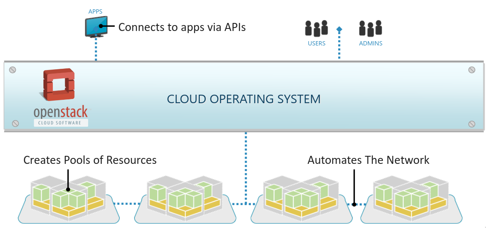

## Openstack as OS

Openstack is a cloud operating system, it is a collection of services that are used to build a cloud. It is a software that controls large pools of compute, storage, and networking resources throughout a datacenter.

To reach those objectives, Openstack is divided into several components, each of them is responsible for a specific task. Each component is a different independent project, and they are all tied together by a common API. It is even possible to modify the code of the components to adapt them to the specific needs of the user.

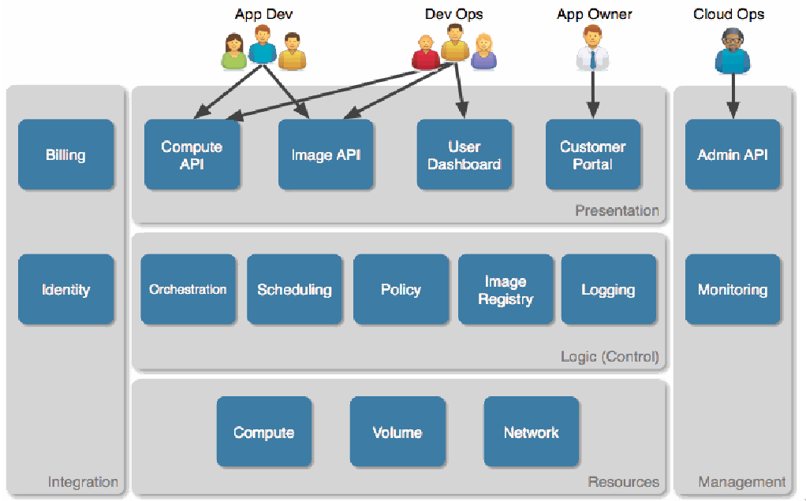

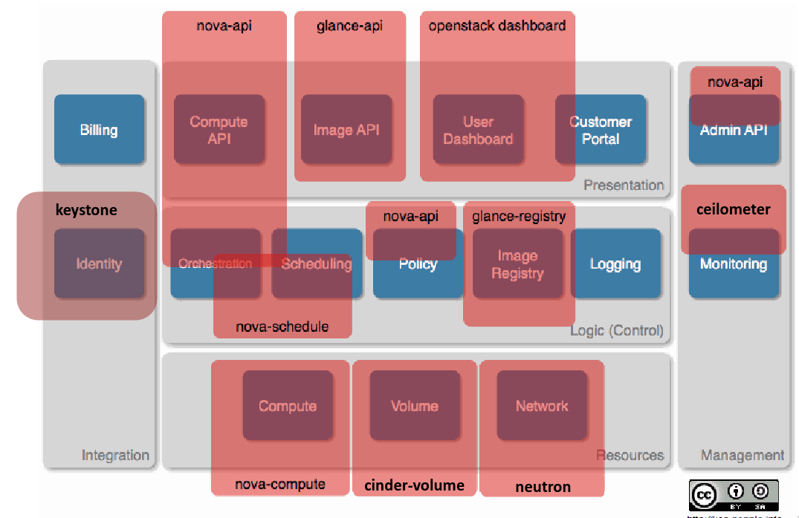

## Openstack main components

Relation between the components:

Each component is easy to scale since are independent from each other.
It'useful to have almost standard API's to interact with the components, this allows to avoid vendor lock-in.

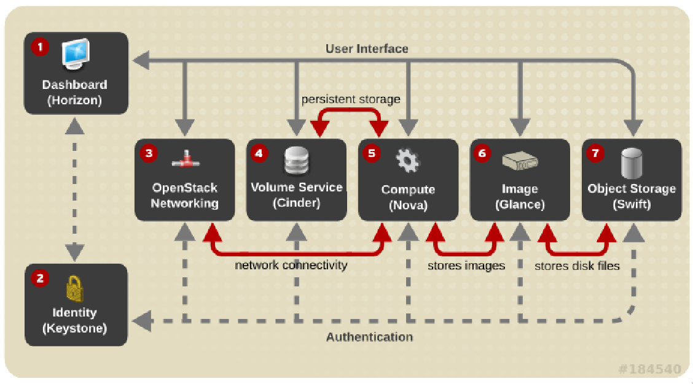
> Take note of each component name, it is important to know them.

### Horizon

It's the dashboard of Openstack, it is the web interface that allows the user to interact with the cloud. It is the only component that the user interacts with directly.
It is useful because if i'd like to read informations without the UI i'd have to create manual locks on DB records, and this is not a good practice.

### Celiometer

It's really important to collect and store logs from the components to make rapid decisions in case of problems. It's important to have a monitoring system that can collect logs from all the components and store them in a centralized place. Telemetry is the component that collects logs and metrics from all the other components. It is implemented by the Ceilometer project.

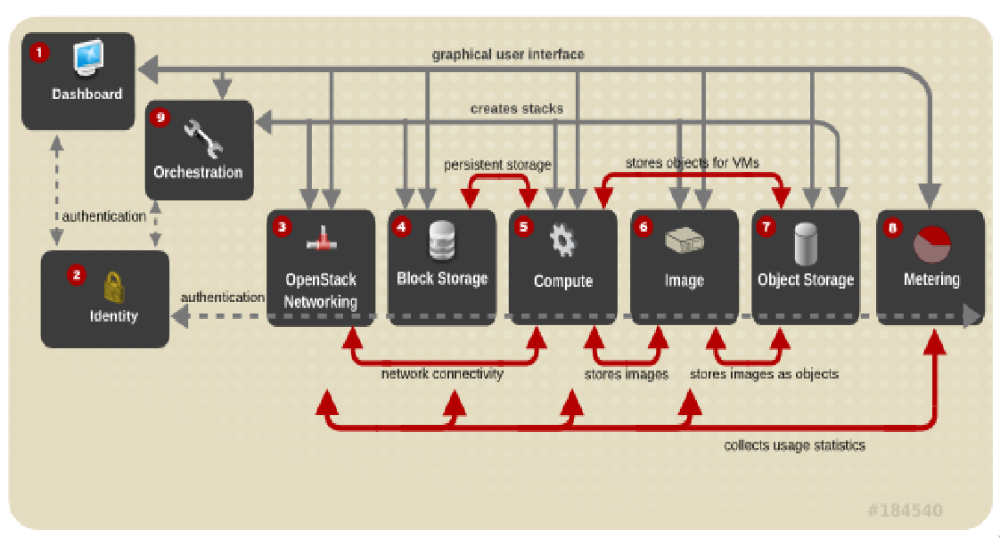

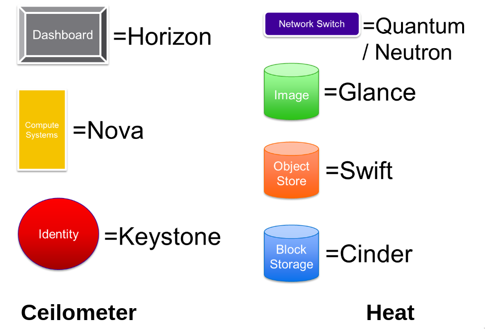

## Openstack design guidelines

- scalability and elasticity:: common endpoint that doesn't create lock in. Horizontal scalability is a must.
- Reliability: minimal dependencies, no single point of failure
- Shared nothing architecture: no shared state between the components, each stores information internally. (easy replication)
- Loosely coupled asynchronous interactions: decoupled pub/sub model.
  
A missing point in this distributed design is strong consistency. If a VM fails, openstack could miss it on the first check.

### Component Design

Deriving from the guidelines: every service consists of the following core components:

- PUB/SUB message service: Advanced Message Queuing Protocol (AMQP). Default RabbitMQ is the used implementation .
- Core logic: business logic, the core of the service. It will be the composition of many sub modules connected to the message service.
- API server: frontend for the service, entrypoint. (RESTful API or gRPC)
- Local DB or storage: can relational or NoSQL. It is usefull in case of failure of the core logic, the API server can still work and the core business can be restarted from the point of interruption.

## Openstack main workflow

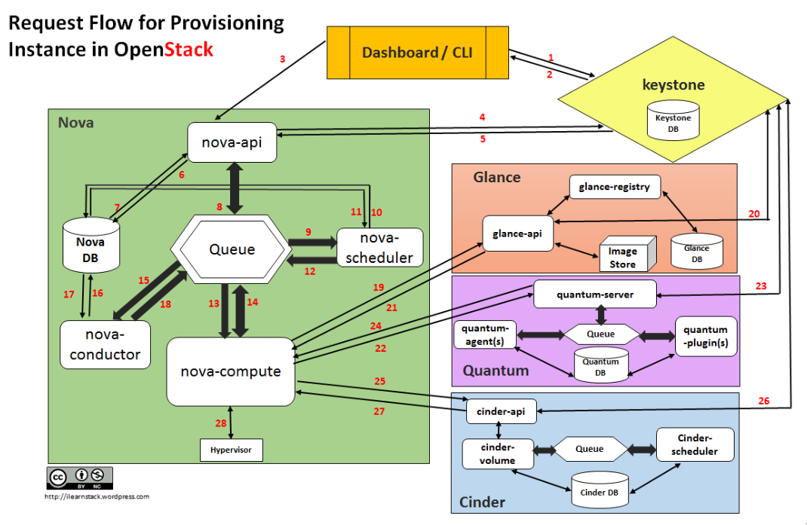

The queues inside components are usefull to:

- avoid the loss of messages
- decouple slow services

### Openstack main services

- Nova: compute service, it is responsible for managing the VMs.
- horizon: dashboard
- Neutron: networking service, it is responsible for managing the network.
- Cinder: block storage service, it is responsible for managing the block storage.
- Swift: object storage service, it is responsible for managing the object storage.
- Glance: image service, it is responsible for managing the images.
- Keystone: identity service, it is responsible for managing the users and the roles.
- Heat: orchestration service, it is responsible for managing the orchestration.
- Ceilometer: telemetry service, it is responsible for managing the logs and the metrics.

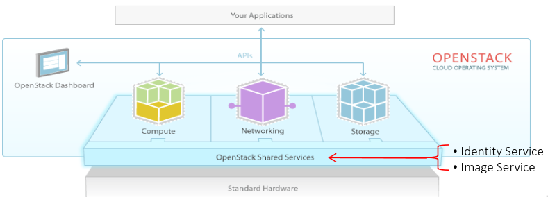

### Nova components

- nova-api: RESTful SPI endpoint, send comma.
- nova-compute: hypervisor, it is responsible for managing the VMs. Each demon on each physical node.
- nova database: stores buil-time and run-time information. Should not be in a compute node, because if the node fails the DB will be lost, it can be vulnerable to attacks.
- nova-scheduler: it is responsible for scheduling the VMs.
- nova-conductor: it is responsible for managing the DB access (nova's data).

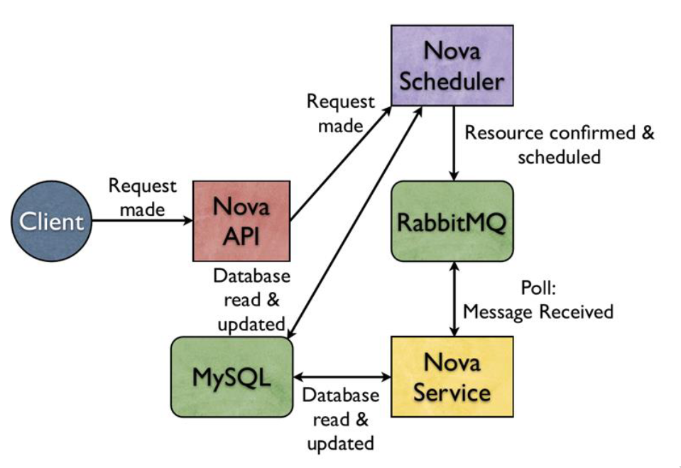

### Swift components

It's an object storage service,, it is a distributed storage system for static data such as images, videos, and backups. It is designed to scale horizontally and to be fault-tolerant.

| File system | object storage |
|-------------|----------------|
| files and directories | plain representation inside a bucket |
| static metadata | dynamic key-value pairs |
| fixed size | variable size |
| Read write operation | Static objects, reads optimized |

- swift-proxy-server: handles incoming requests, uploads, metadata modifications, ...
- swift-account-server: it is responsible for managing the accounts.
- swift-container-server: maps containers inside the object storage service
- swift-object-server: manages files that are stored on various nodes.

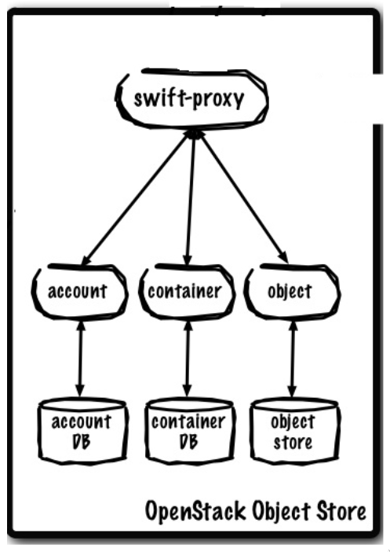

### Cinder block storage

It handles storage devices that can be attached to VM instances. Handles the creation, attachment and detechment of volumes to/from instances. Allows to create snapshots to backup data stored in volumes. Snapshots can be restored or used to create new volumes, usually they are immutable, so stored in swift.

- cinder-api: RESTful accesspoint
- cinder-scheduler: selects the best storage device to create the volume
- cinder-database: maintains volume's state.
- cinder-volume: manages the volume's lifecycle.

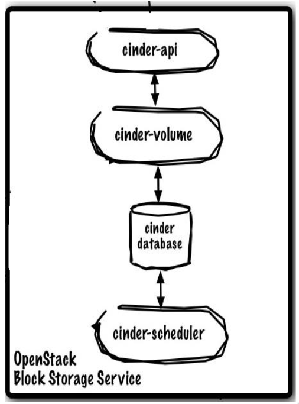

### Glance Image Service

Glance handles the discorvery, registration and delivery of disl and VM images.
It's based on the object storage swift, because images are immutable and usually large. On the instantiation of a VM, the image is copied to the compute node: it's a critical operation and can be a single pont of failure.

- glance-api: RESTful accesspoint
- glance-registry: manages the metadata of the images
- glance-store: stores the metadata

Glance uses an external service to store the images, it can be swift, amazon S3 or even a file system (only for small deployment).

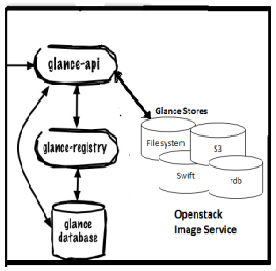

### Horizon Dashboard

Modular web-based user interface that provides a dashboard for users and administrators to access, provision and automate cloud-based resources. It is the only component that the user interacts with directly.

- Dashboard stateless, exposes API to do everything
- Can create custom tools using APIs
- Dashboard access is time consuming, it's better to automate.
  
### Keystone Identity Service

Keystone is a framework for the authentication, authorization for all the other openstack services.
Provides 4 main services:

- Identity: authentication and authorization
- Token: token generation and validation, istead of passwords.
- catalog: endpoint registry to discover services
- Policy: authorization rules

Requests are stateless and contains the auth token.

1. Get the token from keystone
2. Use the token to access the other services

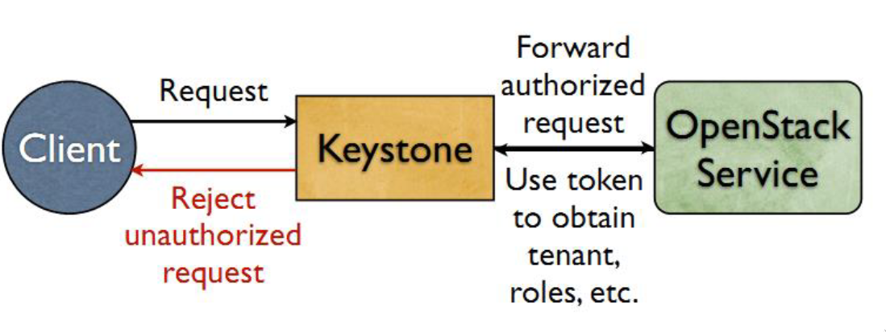

### Neutron Networking Service

Pluggable, scalable and API-driven system for managing physical networks and IP addresses. NaaS approach: Network as a Service.

Multitenancy: isolation, abstraction, and pooling of network resources.

Technology agnostic: APIs specify service, while vendor provides his own implementation. Extensions for venfor specific features.

Loose coupling: standalone services, also outside openstack.

- neutron-server: RESTful API access point
- plugins and agent: executes real actions such as disconneting ports, creating networks and subnets, creating routers,... are decoupled from neutron functionality
- Message queue: delivers messages between quantum-server and various agents.
- Neutron database: maintains network state for some plugins
- DHCP agents: manages DHCP for networks
- L2 agents: runs on each hypervisor to perform local vSwitch configuration (virtual lan)
- L3 agents: provides L3/NAT forwaring to provide external network access for VMs
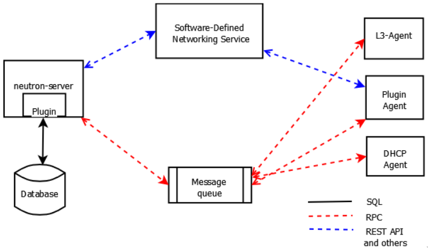

Neutron can implement vLan inside the cloud, it decouples the logical view of the network from the physical view.

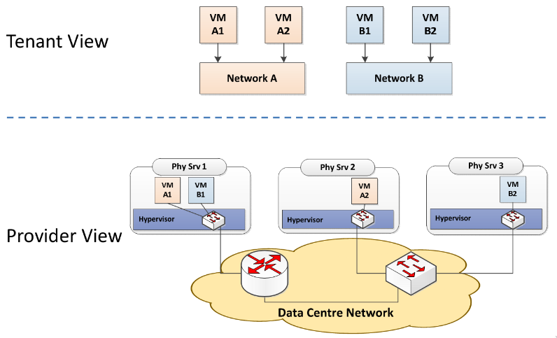

L2 also manages the port to access the VM's, by desing it's a firewall for the VMs.
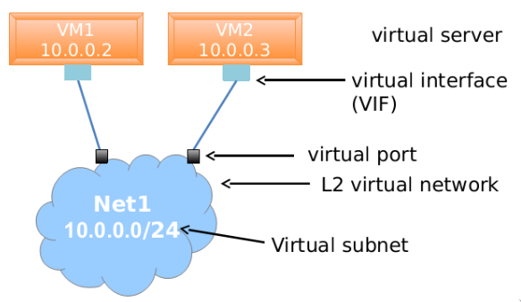

