# Overlay Networks and Advanced Filesystems

The goal of an Overlay Network is to have a logical connection among different and very far entities spread over different location and networks. Overlay networks work at application level and connect different entities to be considered together a group.

The core requirements for an overlay network are: **efficiency**,**dynamicity**, **scalability**. The important part is how organize it and also **how to gran QoS** and **respect an agreed SLA**.

An ON example could be VPNs.

The ON cna be dirrerentiated in:

- unstructured: nodes choose randomly the neighbor to use to access to the ON.
- structed: Organizes the architectures, maintained also to reacct discontinuties and failures.
  
Ons propose solutions for **P2P applications**, but also for **MOMs** (even if they are statically-oriented).

- P2P: napster, gnutella, kazaa, bitTorrent.
- Support: Chord, Pastry, Tapestry, CAN
- Social Nets: MSN, Skype, Social network support

## Usage

The nodes should:

- get in
- make its actions
- help actions of others
- get out

Actions to be done:

- Lookup ( application level ): find out very fast the appropriate user information in the ON (look among the nodes)
- Guaranteed Throughput ( support layer ):
  - to Communicate over an ON needs support for distribution/dissemination
  - to Replicate content
- Management:
  - maintain efficienctly the On under a high rate of connections/disconnections
  - reliability and availability (very difficult)

Most important property of an overlay network is the **replication of resources**: make them available anyway
(independent on any event pattern on the ON)

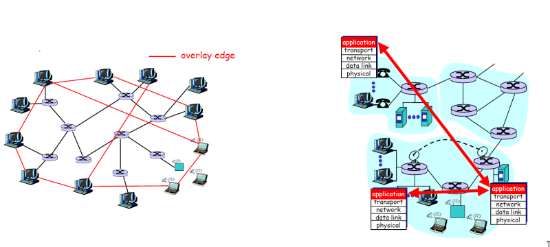

## NAPSTER: a pioneer P2P

A non-strucuted approach for file retrieving:

- **Centralized Lookup**: One centralized directory services deal with nodes entertaining.
  - Any node connects to a napster server
  - Any node **uploads list of files to server**
  - Any node gives server **keywords to search the full list**

**File Exchange peer to peer:**

- Lookup is centralized from servers
- Files Copied peer to peer

Performance **bottleneck of directory** and consequent **low scalability**.

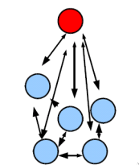

## Gnutella

Unstructured ON with distributed approach in file retrieval. Any node tries to connect to some others locally available. **Fully decentralized organization and lookup for files.**

There are nodes with high degree of connection and nodes with low degree. High degree nodes may receive and control even more links

- **Flooding based lookup**, inefficient in scalability and bandwidth
- Limiting the cost as much as possible

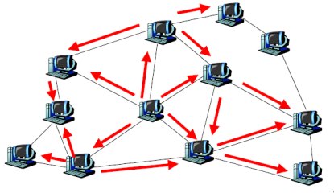

### search Steps

1. Join the network

2. Determinine who is on the network
   - *Ping* packets used to announce presence on the net
   - Replies with *Pong*: contains IPaddress, port number. Pongs come back via the same route of ping.
3. Search **Query**:
   - ask other peers (N usually 7) for desired files, content matched by string
   - Peers send packet to connected peers if doesn't have it (N usually 7)
   - Continues for TTL steps, tipically 10
4. Downloading: Peers reply with a **"Query Hit"** containing contact info. File transfers via direct connection by using HTTP protocol, GET method.

Number of reached users:

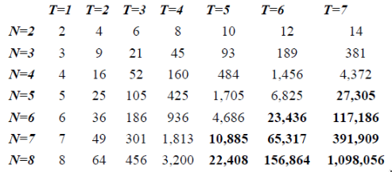

### Considerations

Flooding based search is **extremely wasteful in bandwidth**. All users do **searches in parallel**: local load grows linearly with size.
Taking advantage of the unstructured network new efficient protocols came:

- Controlling  topology: Degree biased random walk.
- Controlling of palcement of objects replication.

## Random scale vs Scale free networks

a. **Random scale network**: nodes have a number of connections that follows a Poisson distribution.

b. **Scale free network**: nodes distribution follows a power law or an exponential law. Few nodes have a lot of connections, many nodes have few connections. High degree nodes are called **hubs**, stores the index about a large portion of the network, are easier to find with a random walk.

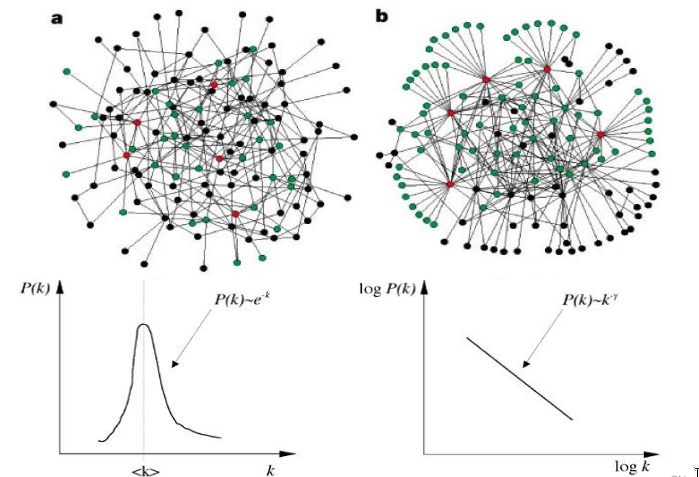

Gnutella is a scale free network:

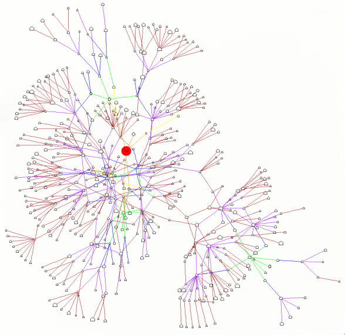

Random walk: moves ranomd to avoid visiting always the same already visited nodes. If a node is an hub, the query can reach many more nodes.

Degree-based random walk:

- Select highest degree nodes (hubs) to visit
- Walk first climbs to highest degree nodes, then climbs down to lower degree nodes
- Optimally coverage can be formally proved

### Gnutella Replication

Spread copies of objects to peers, more popular objects can be found more easily.
Replication strategies: replicate $i$ when $q_i$ is the query rate of object $i$.

- Owner replication: produce replicas in propotion to $q_i$
- Path replication: replicate in proportion to the number of hops to reach the object, Square root to $q_i$.
- Random replication: Same as path replication to $q_i$, but using random walk, not the path.

Is it still difficult to find rare objects.

## Structured networks

- Unstructured P2P networks allow resoufces to be placed at any node spountaneously.
- Structured P2P networks organize the resources in a deterministic way, more efficient.

### DHT (Distributed Hash Table)

DHT uses hash principles toward a better retrieval of data in a distributed setting.

The DHT is a **distributed database**. Nodes nust support the storing on values and the retrieval of values. Lookup must be fast. Chained hash table design is used.

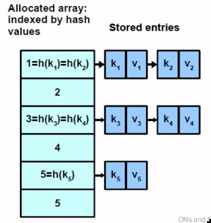

You can partition the whole spacce of keys via a ring in which you have different containing nodes. Nodes can store values to be retrieved by a key. The key is hashed to a number and the node that is responsible for that key is the one that is the closest to the key in the ring. You must decide where to put data and how to get data fast.

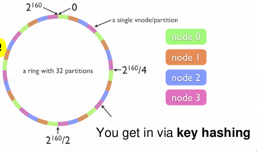

Properties: Nodes get in easily, but often can get out

- Safety of data, do not loose any information
- Adaptation to changes in the network (nodes can get in and out)

Hast table fucntions for ON are tipically P2P: Key-hash $\rightarrow$ node mapping.

- Assign a unique live node to any key
- Find this node quickly
- Query can work in parallel over different nodes

Some forms of replication must be decided to avoid to lose data and to maintain copies.

#### Replication and partitioning

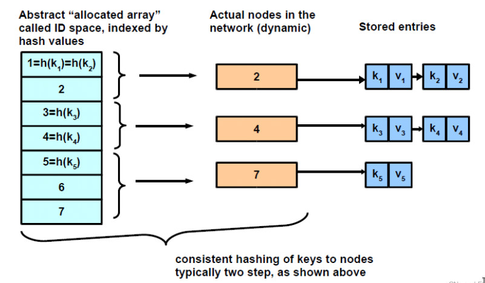

- **Load balancing**: maybe even change the key-hash when the nodes change $\rightarrow$ necessity of mapping on the fly.
- **Replicate entries on more nodes** to increase availability by using neighbor close nodes.

### Chord

Chord is a DHT that uses a ring to organize the nodes. The ring is divided in $2^m$ partitions, each node is responsible for a partition. The node is responsible for the first key that is greater than the node's ID.

Both keys and nodes are hashed to 160-bit IDs (using SHA-1). The ring is organized in a clockwise way. Key are assigned to nodes by usign consisitent hashing. The key is assigned to the first node that has an ID greater than the key's ID.  

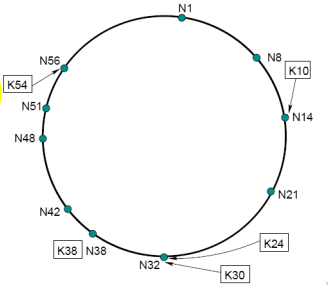

#### Chord primitive lookup

Lookup queries arrives from any node and forwarded to the successor in one direction (one way). Forward the query around the circle. **The worst case, O(N) forwarding is required**, reduced to O(N/2) if both verses are used.

#### Chord Efficient Lookup

Fast forward in one direction skipping the vicinity. Chords keeps finger tables to identify quickly far nodes.

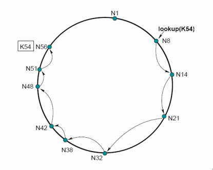

#### Scalable lookup

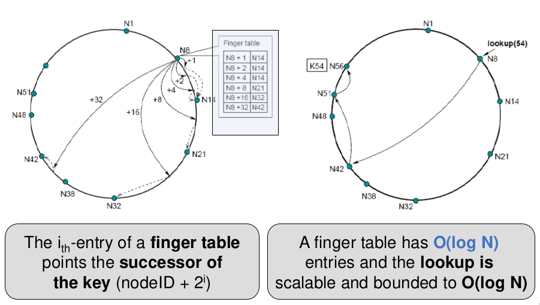

**Finger Table Structure**: Each node maintains a finger table with entries that point to other nodes in the network. The (i)th entry in the finger table of a node with ID (n) points to the first node whose ID is at least $((n + 2^{i-1}) \mod 2^m)$, where $m$ is the number of bits in the maximum ID value. This means the finger table entries span exponentially increasing distances around the ring, allowing for efficient routing.

#### Chord consistent hashing partitioning

consistent hashing:

- randomized: all nodes receive roughly an equal share of load (non balanced)
- Local: adding or removing a node involves an O(1/n) fraction of the keys getting new location

#### Chord node Join

A new node has to:

- fill its own successor, predeccessor and fingers

Simple way: find its successor, then stabilize, optimize lazily and lately.

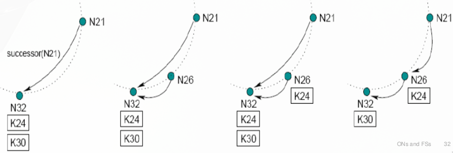

Fingers are needed only for the sake of speed.

#### Chord Stabilization

- Each node periodically runs the stabilization routine
- Each node refreshes all fingers by periodically calling `find_successor(n+2^i-1)` for a random i.
- Periodic cost is $O(logN)$ per node due to Finger refresh

#### Failure handling

**Replication**: instead of one successor, we keep a number of R sucessors. In robust DHTs, **keys replicate on the R successor nodes** of any node.

If a finger does not answer, take the previous finger, or the replicas if close enough.

### Pastry

Pastry is a DHT ON, like chord, differently organized for efficient access. Based on a sorted ring in a ID space (as in Chord).

Node and objects are assigned a 128 bit identifier. NodeID interpreted as a squence of digits in base $2^b$ (not bits). In practice, if the identifier $b=4$ is used, names are viewed as succession of cypher Hex (base16), $128$ bit space $\rightarrow 32$ IDs.

The node responsible for a key is the numerically closest in hex starting from most significant.

- bidirectional sequencing by using numercial distence
- routing tables shortcuts can spread up lookups

Nested groups the neighborhoodfor replication.

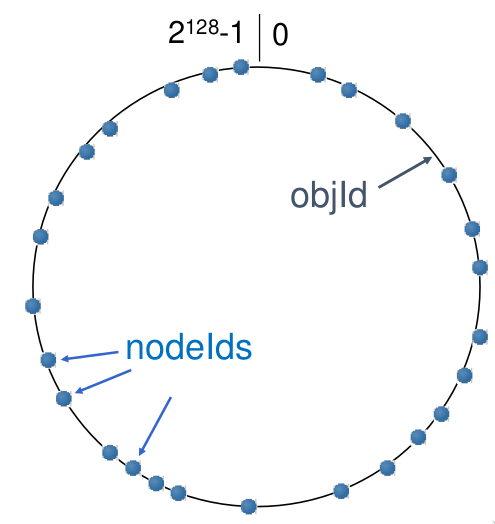

Pastry keeps two tables:

1. **routing tables** (numeric neighborhood) to explore proximity and find **numerically close neighbors**
2. **Leaf sets** (vicinity) to **maintain IP addresses of nodes with closest leger and smaller nodeIds** in the close neighborhood

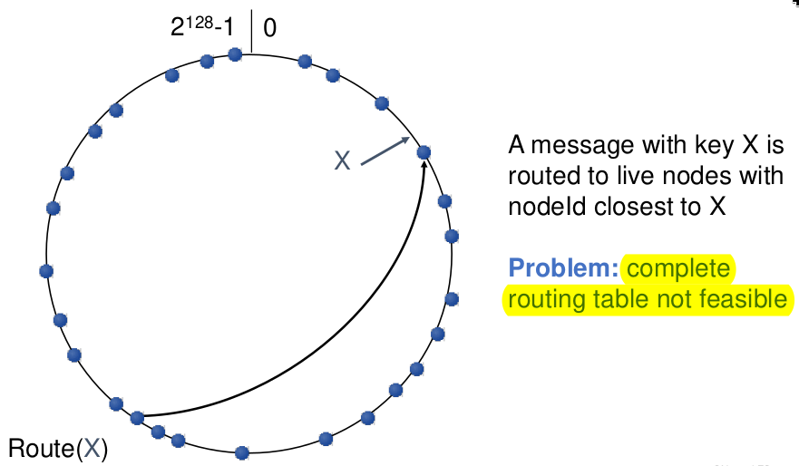

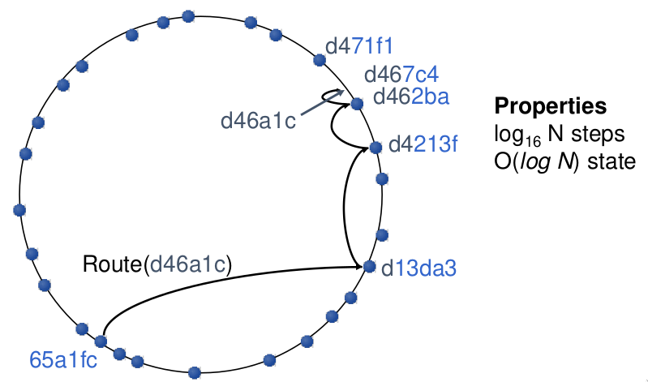

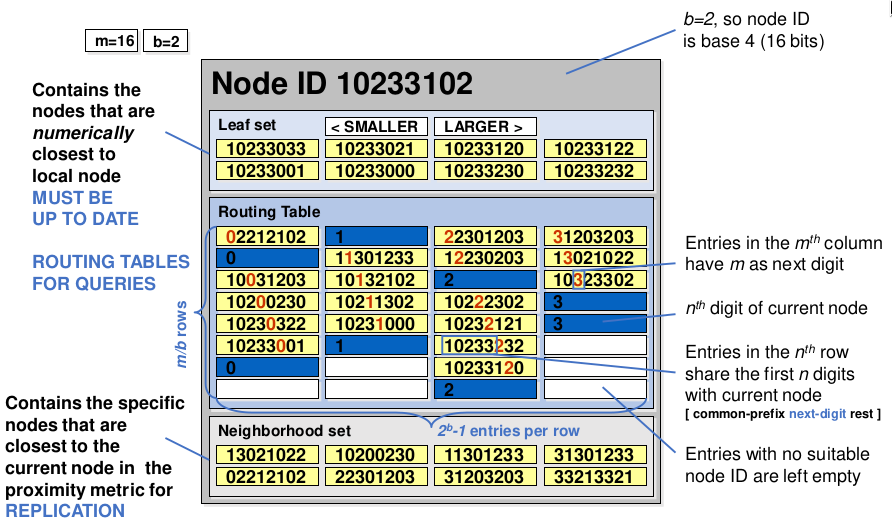

## Distributed File System

NFS is based on the idea of client machines that interacts with server machiens where files reside (C/S model).
After mounting a file system in any client, nfs is stateless and efficient: while teh load is one the client, and connections are UDP (exists variants with TCP). **NFS lacks of any idea of replciation and QoS**.

The Client file system can share different contents with serveral servers obtaining a personal global vision with different views.

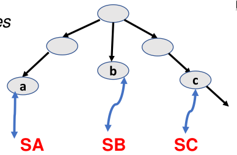

NFS lack of any idea of sharing the same view of the same global filesystem among all nodes.

### Implementation

NFS had the intial goal of using RPC for the entire communication supports so it strives for efficiency and cost reduction.

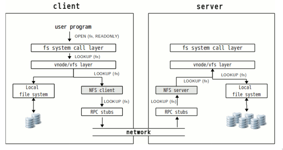

The implementation are optimized and overhead is very low, but still there isn't **No replication, nor QoS, no global view**.

## More quality file system

Global quality: replication, uniformity in view of the tree.

### Andrew File System AFS

- A user can see the same view of the file systems.
- Files are replicated, always available
- Dynamic Replication, file cached at the client site and more copies can be added
- The client uses a call-back to signal change actions to the server
- any possible os support and several additional services are provided

## Global File system

Data storage, necessary quality and also global scalability. ex.: GFS, Hadoop, ecc...

### GFS: google file system

Large scale, thousands of machines with thousands of disks. Files are huge (normal files have multi-GB size), it's a design decision: it's difficult to manage billions of small files.

File access: model is read/append (almost no writes). Most reads are sequential and random writes are pratically non-existent.

#### Design criteria

Detect, tolerate and recover from failures automatically.

Read-mostly workload:

- Large streaming reads (multi-mb at a time)
- Large sequential appens operations

Highly-sustained throughput much more important than low latency.

Files are stored as chunks kept with their descriptions (metadata) and stored as local files on linux file system.

Reliability through replication (at least 3+ replicas). Single master coordinates access and keeps metadata

- Simple centralized design (one master per GFS cluster)
- Global knowledge to optimize chunk placement and replication decisions using no caching. Large straming $\rightarrow$ useless cache. Clients caches metadata by linux buffer cache.

One master server and many chuck servers over linux. Chucks: 64 mb portion of file with globally unique IDs. Chuncks are spread across racks for better throughput & fault tolerance.

**Metadata**, one per chunk, 3 types possible:

- file/chunk namespace
- file to chunk mappings
- location of replicas of any chunk

Kept in memory: 64 bytes per chunk.

Large chunks have many advantages

- fewer interaction client-master
- smaller metadata
- Persistent TCP connenction client-server

Control operation on files are metadata changes, must done sequentially. Write operations are called mutations.

#### Step by Step write

1. Indentify master chunk server and replicas
2. Push data to all replicas
3. send mutation request to primary
4. forward mutation to all secondaries
5. Ack completion
6. Reply (an error in any replica results in an error code and retry)

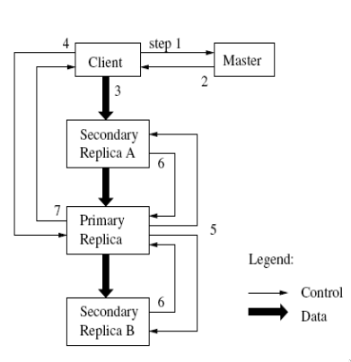

**Mutation:** write operation that changes wither the contents (append/write) or the metadata.

**Lease:** used to maintain consistent mutation order across replicas. Primary picks a serial order to all maturation to the chunk. All replicas follow this order when applying mutations.

#### Consistency model

file namespace mutations are atomic. Consistency state of replicas can be:

- Consistent: all clients see the same data.
- Defined: consistent and client sees the mutation in its entirety

Example of **consistent and undefined**:

```text
initial record = AAAA
concurrent writes: _B_B and CC_C
result = CBAC 
```

None of the clients sees the expected result. data reconciliation must run.

### Hadoop HDFS

Master/secondary architecture

- name node is the master
- data node are secondary, one copy per node in the cluster
- files are stored in blocks in serveral data nodes

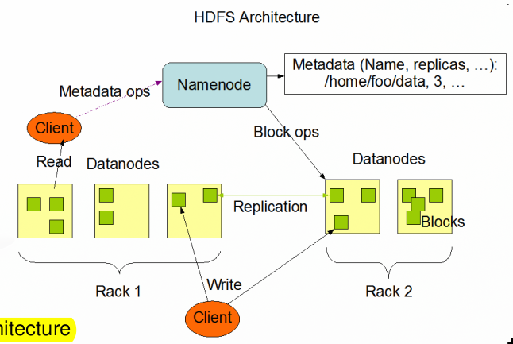

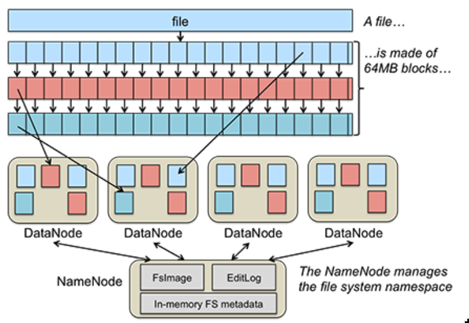

Applications access with write-once-and-read-many so the consistency model is similar to GFS. Computation in moved close to the related data.

- name nodes execute file system namespace operations (oopen, close, directories)
- data nodes execute read/write operation requested from clients

HDFS is written in java and must work on normal hardware to store very large files. Any file can decide its block size and replica degree, also dynamically.

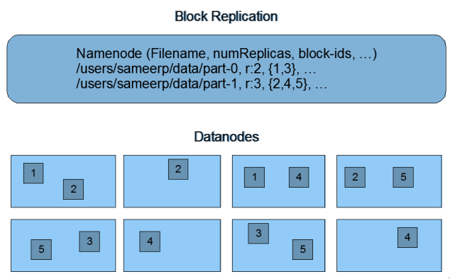

Namenode receives heartbeats and block reports from datanodes.

- heartbeats: operation state of data nodes
- Block reports five the current block situation on datanodes

## Conclusion

ON and distributed fs are black boxes used by any global applications, they are mechanism to build over new tools.

They should favor some system properties:

- Life cycle widening
- scalability
- dependability

Also try to favor strategic choices:

- dynamicity
- availability
- Final consistency
- fast answers
