# QoS basis and Procols

With Tcp/IP transport the entities communicate using resources available during execution dynamically **without predefined commitment**.

## Application Classification

- **Elastic:** traditional. Do not present quality constratints
  - Work betterwith low delays and work worst during congestions
  - Interactive with delays less than 200ms
- **Non Elastic**: time constrained modern application
  - Have time constraints, less tolerant. Can not work if are not present enough resources.
  - The service can be adaptive and compromise:
    - Delay adaptive -> audio drop packets
    - bandwidth adaptive -> video that adapt quality

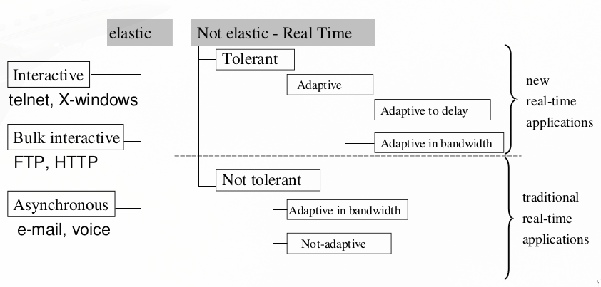

## Stream qos parameters

Functional parameters:

- Promptness in reply
- Bandwidth: quantity of data transmitted bya channel with success per time unit
- Throughput
- Reliability: percentage of success/failures
- **Latency**: the time spent to send an information unit (bit) also meauserd as the round trip time (back and forth). $T_l = T_p + T_x + T_q$
  - $T_p$ : depends on the speed on light inside the medium **(space/speed)**
  - $T_x$ : depends in messages and bandwidth **(dimension/bandwidth)**
  - $T_q$ : delays on intermediate points. **Critical, involves all waiting overhead**
- **Jitter**: variance of the latency. In optimal situation latency is stable.
- **Skew**: Offset between multiple flows composing a unique stream

But also non functional parameters are important.

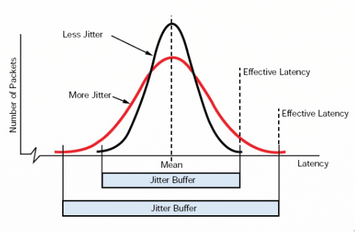

A good service requires to identify bottlenecks and must consider resource management

- If I send 1 byte: latency is more perceived
- If I send many megabytes: bandwidth is more perceived

**Resource occupation:** product of $latency \times bandwith$

Simple strategies always applied:

- keep pipes full, but time must be considered carefully
- Buffering time inside applciations in typically considered

### Non functional parameters

Evaluated by the final users:

- Image details
- Image accuracy
- responde time in variation
- audio/video synchronization

Qos can be guaranteed only through a negotiated and controlled contract and after provisioning. **Necessity of observation and feedback: monitoring**.

### Quality of experience

- Relevance (priority)
- QoS perceived
- Cost
- security (integrity, authentification)

## Management

Management actions can be both:

- Proactive (static): decided before execution
- Reactive (dynamic): identified during distribution

Focus on **Service Level Agreement**

### Static

- Precise definition of Qos Levels and SLA
- Negotiation
- Admission control: comparison between requested Qos and available resources
- **reservation of resources**: needed resource definition for allocation to obtaion requested QoS
SLA represents the static agreement

### Dynamic

Monitoring of eventaul changes to respect the defined policy

- continuous measurement
- respect synchronization
- renegotiation of necessary resources
- **change of resources** to maintain Qos and adjustment to new situations

**Reservation and change** of resources **are local actions non provided in protocols**

### Active Path

You must find and active path between emitter and receiver, anyway, also by flooding

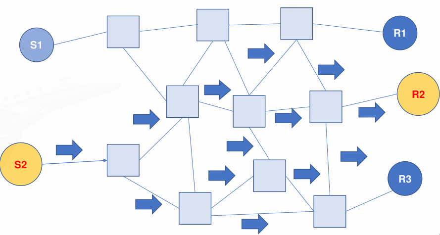

Among severals must choose one to employ. Intermediate nodes must agree on the negotiated SLA.

The specification of an SLA is always a coordinated eddort among emitters and receivers.

- Emitter: Can i send that specific streaming with that B bandwidth and that A accuracy?
- Receiver: I can accept just that streaming with that B1 bandwidth and that A accuracy, with latency L.

## Management and monitoring

Necessity to match application plane with strategies for efficiency control. Keep in mind the three planes of a service:

- User plane
- Management Plane: must collect data
- Control Plane: takes action based on data

Granting the QoS is high cost. Dynamic data collection mechanism must require not too many resources. **Minum intrusion principle:** monitoring must attempt not to comete with applications for resources.

### OSI System management

Osi distributed management: Use of **standard description of objects and actions**.

Defines a layer 7 protocol: CMIP (Common Management Information Protocol), which is an implementation for the CMIS (Common Management Information Service), allowing communication between network management applications and management agents. [1](https://en.wikipedia.org/wiki/Common_Management_Information_Protocol)

## Agent/Manager model

Management standard based on two roles:

- manager
- agents: responsible of managed resources

Manager/Agents model can lead to very simple implementation.

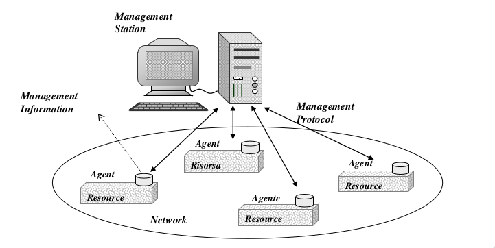

### SNMP

Snmp: Simple Network Management Protocol, standard by IETF. It uses TCP/IP, very spread in UNIX systems and LAN environments, SNMP operates on CMIP subset (incompatiblewith CMIP standards). Since it was really simple, over the years had passed redefinitions to keep count of:

- security
- flexible management
- existing legacy systems
- not only devices, entities of any type

SNMP uses **one manager (only one)** and **some agents** that control variables representing the objects, identified by **unique names (OID in hierarchical directories)**, stored in the MIB database.

Manager requests actions `(get and set)` and receives response. Agents wait requests and can also send `trap`.

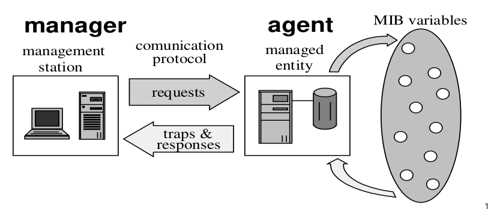

Some messages used on UDP (port 161 messages, port 162 inside manager for trap):

- `Set`
- `Get`
- `Get_Next` (multiple attribute)
- `Trap`

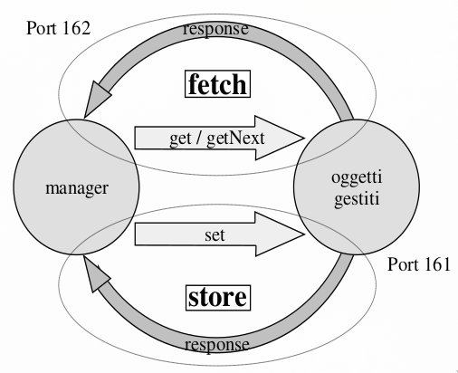

#### SNMP Agents

Must handle requests of get and set form the manager, can generate traps when some events occur.
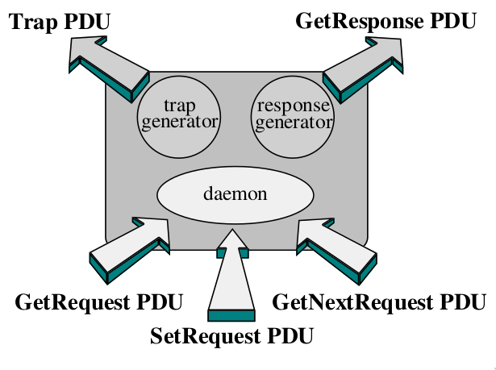

#### SNMP Manager

Must handles respondes and traps from agents.

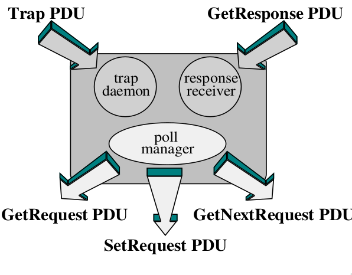

#### SNMP Standards

Data description ruled by:

- SMI (structure of management information), to define objects - ASN.1 and BER standard
- MIB (management of information base), to manage direcories of objects - X.500 standard

#### Proxy Agents

A proxy agent is an agent and a manager. Introduced to overcome the problem called **micro management** (i.e., the congestion around manager). The proxy can collect results and send them in an aggregated form.

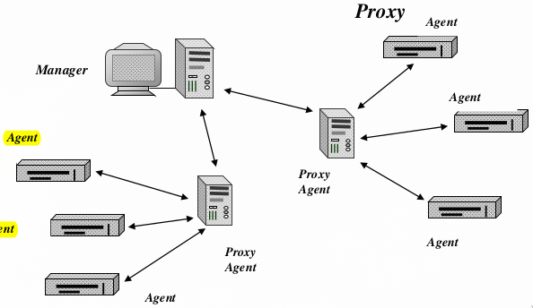

## Network and traffic Management

Snmp can deal only with variables inside the agents, the processes. To manage the network enter **Remote MONitor, RMON**, designed to give visibility on traffic.

It introduces monitor agents and and the interaction protocol between manager and monitors.

RMON is **oriented toward traffic and bandwidth**, not toward devices.

**Probe** is an entity capable of **monitoring packets** on the network, **can work autonomously** and **also disconnected from the manager** to track subsystems and **report filtered information** to the manager.

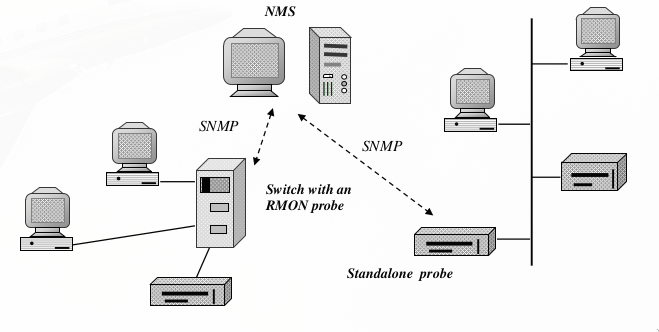

Enhance model of distributed management based on:
| | |
| - | - |
| Active entities | Manager |
| Managed entities | Objects |
| Intermediate entities | Agents |

With objects that can be managers themself to organize a flexible hierarchy.

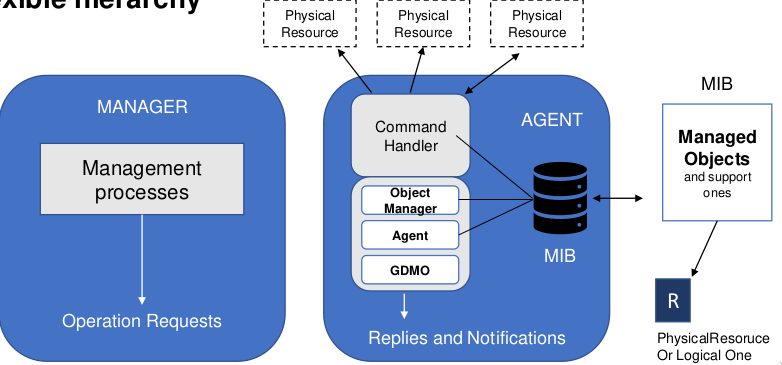

### Advanced network management

Managed object are the resources, described as objects:

- simple resources (a modem)
- complex resources (more interconnected systems)
- can be created dynamically

The managers realize management policies based on managing different agents of other managers (?). A manager can both insert a resource and remove it dynamically.

The agent can also execute actions on manager request.

#### CMISE/P

It's an advanced protocol used from telcom to manage WAN. It realizes a dynamic model at its maximal degree: it can also define new action for the agents dynamically.

## Control Plane Protocol: Session Protocol

SIP, session initiation protocol, is able to support and manage multimedia sessions. The goal is to define and manage a session to support a multimedia service that is provided by other protocols. SIP uses Http compatible content, text-based and purely client/server.

Messages:

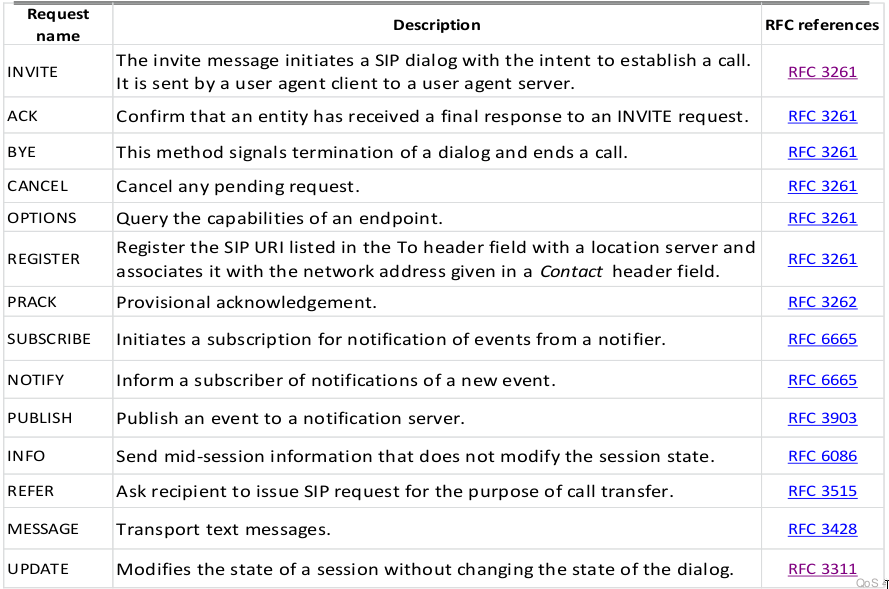

An interaction flow:

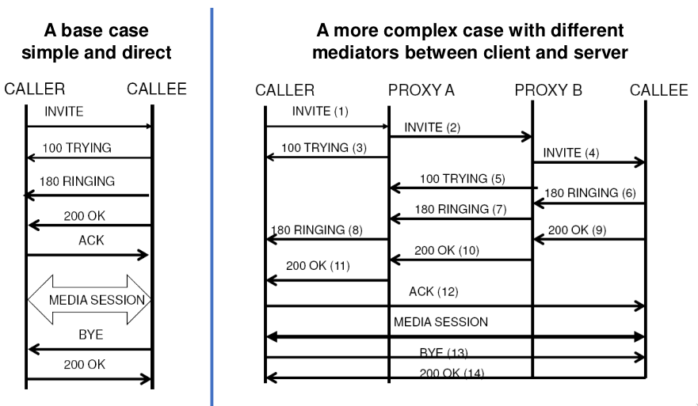

There are different fucntional entities:

- User agent: endpoints, client and servers.
- Proxy server: routers at application level, can keep state of session transactions
- Redirect server
- registar server: service for user registration to the infrastructure
- Location server: service to allow link interested users to their location

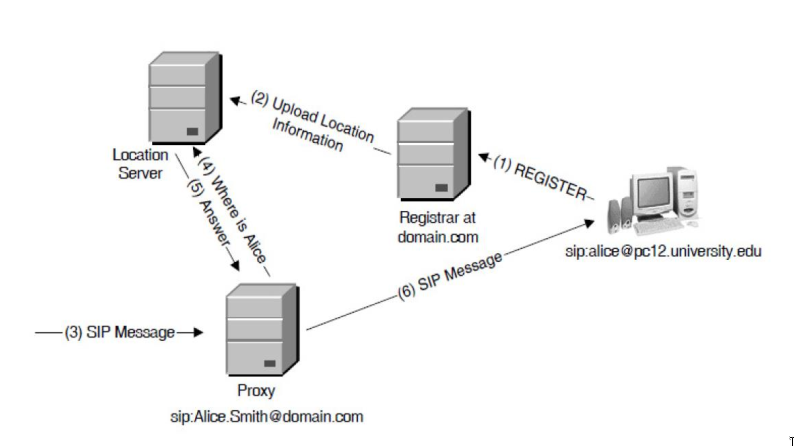

Messages are structured as: start-line, header, message body (optional). If it is a request in the startline there's the name-method, protocol version and the request URI. If it is a REPLY there's protocol version, state code, explicative phrase. the body can contain firther information on flow and service.

## Router Internet

### Best Effort

The routers move packets without differentiating queuing or scheduling and without distinguish between flows.

A router executes for **every packet** that is put into a **FIFO queue**

1. verification destination
2. check routing tables
3. select best output path (maximum match length)
4. Forward the packet

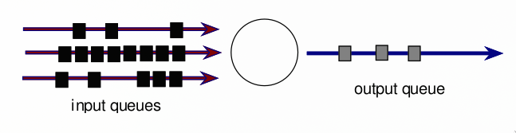

Standard routers don't support any QoS.

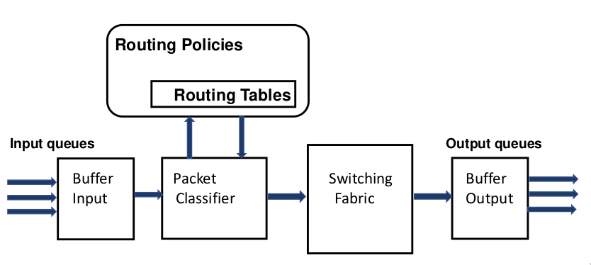

The normal standard policy is FIFO, a unique queue for every flow of the router: no service differentiation. *Routers must pass messages ASAP.*

**Law of conservation of work (Kleinrock):** A router (work conservative) cannot be idle if there are packets on any input/output port (delays can't be introduced).

If there are $n$ flows with **$\lambda_n$ traffic** for every flow, and a **service mean time $\mu_n$**, then the **use is $\rho_n=\lambda_n\mu_n$**. Where:

- $\rho_n$ represents the mean usage
- $q_n$ represents the mean waiting time

The **Kleinrock Law** for work consertative scheduler states: **$\sum \rho_n q_n = C$ constant**.

If the router gives a lower delay/higher bandwidth to a flow, has to increase/reduce it for another one. Cannot favor a flow without damaging another one.

### Router QoS policies

Qos can be obtained by conditioning the traffic: monitoring of the traffic and taking actions to decide more sophisticated policies of services. Cloud be:

- delay some packets
- discard some packets

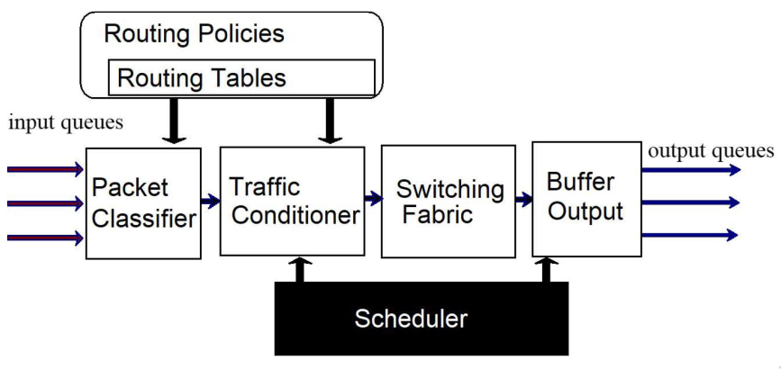

QoS Routers have policies for queuing and scheduling, based on packet, length or destination/source (flows). A router can have a packet classifier and a function for traffic conditioning.

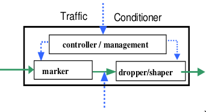

How to intervene on routing to obtain respect of some SLAs? By marking every datagram and acting on it.

Traffic management is typically provided by intermediate router nodes. They must consider different flows to maintain the QoS:

- Routers must keep the **State to differentiate flows**
- Routers must make **queue managements activities**

### Models for QoS routers

QoS routers are non Internet complaint because **they don't respect the Kleinrock Law**.

- Leaky Bucket: the router has a limited memory for messages and some limits in output
- Token Bucket: the router is only delaying messages, that must kept into the memory waiting to get out.

The bucket models: control flows through capacity. **The policy is still best-effort**:

- If packets arrive to quickly they are dalayed
- If packets arrivie in execess they are thrown away or lost.

#### Leaky Bucket

The router must know the flows and possible service capacity. The router ACTIVELY shpaes services with the strategy of limiting output flows.(A bucket per flow).
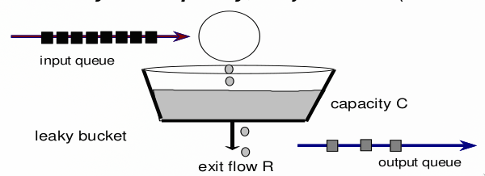

Leaky bucket aims at **switching off packets bursts**. A packet is queued only there's space in the bucket. The packets can exit with a maximum speed $R$ that limits the allowed input flow $r,(r>R)$

#### Token Bucket

Token bucket considers flows history via tokens as authorization for passing.

- Empty bucket: not pass and wait
- Full bucket: tokens can be associated with packets to pass
- Partially full: some messages can pass, others have to wait

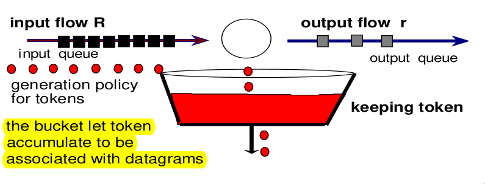

Token bucket allows packets bursts: if data arrives too quickly, beyond the admissible output flow, **they can exit when enough corresponding tokens are accumulated.**

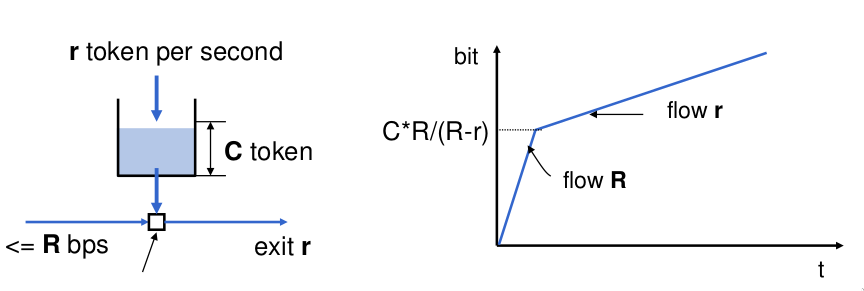

The token imposes delay to **grant a requested buffered resources**.

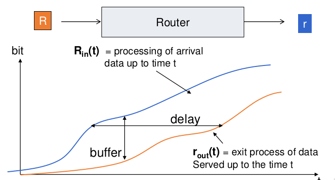

Often the two buckets are used in serial chain.

### Policies of QoS routers

While Internet routers are FIFO, respecting Kleinrock Law, **Qos Routers** don't: they **must penalize someone to give priority**. How?

Scheduling and queueing must respect properties:

- Implementation ease
- Fairness: any flow must be penalized the same as any other

#### General fair strategy: MAX-MIN

Max-Min share: requests of different resources by different flows must be considered in order of growing requests. (First the ones that require less)

- $C$ global max capacity of resources
- $X_n$ resources request by flow-n
- $m_n$ previously allocated resources to flow-n
- $M_n$ available resources for flow-n

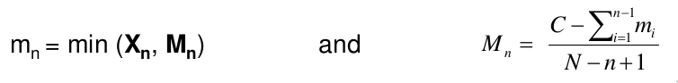

The Max-Min model lets pass first the flow that has fewer demanding requests. the scaling down is done only in lack of resources. 

#### Generalized processor scheduling

Defined some classes for packets (flows), each flows is configured with one weight $w_i$. The GPS ensures that the flow $i$ in the interval $(s,t]$, if the queue is never empty, then this relation is always true: $w_j O_i(s,t) >= w_i O_j(s,t)$.
> $O_k(s,t)$ is the amount of bits for the flow $k$ on the interval $(s,t]$.

This means that the flow $i$ receives at least the rate:

  $R_i= \frac{w_i}{\sum w_j}R$ 

It is a very fair policy: given a priority, at the worst case it is respected for each flow, if a flow has an empty queue then the others get is share in an equal way.

> :warning: it is not possible to implement GPS in reality, it is possible only to servce packets, not bits.

