# Function as a Code, aka Serverless

The core idea of serverless is to abstract away the infrastructure and let developers focus on writing code. The business logic is deployed as functions, which are triggered by events, in an anonymous server managed by a cloud provider.

The cloud provider takes care of scaling, monitoring, and managing the infrastructure. The cloud provider charges based on the number of executions and the execution time, this approach is also known as **Zero-scaling**.

## Functions

Functions are:

- stateless
- short-lived and can be
- written in any language
- Triggered by events (HTTP requests, database changes, or file uploads)

The Events are defined by the cloud provider, this can be a huge problem of **vendor lock-in**. Different provides can define different events and workflows for chaining functions.

### Backend as a Service (BaaS)

Vendors support the developmentof FaaS (but also Iaas, Paas,...)  by providing a set of services common to many applications, such as:

- Database as a Service
- Storage as a Service
- CDN as a Service (CDN: Content Delivery Network)
- Authentication as a Service (open ID, OAuth)
  
This approach is very cost effective for cloud providers that can share the infrastructure among many users and deployments. Matter of fact, FaaS was born in response to the high level of unused resources.

### Definitions

- Event: the representation of an action or a change in state
- Function: the code containing the logic required to process an event
- Workflow: the association between an Event and a Function

Main characteristics:

- Event driven model
- Automated lifecycle management
- Abstracts infrastructure complexity
- **Fine grained and Zero scaling**
- Extreme reuse of code and modularity
- Function composition, could result in an Antipattern

## FaaS Architecture

- **Trigger**: converts external events to local events for the platform
- **Controller**:
  - Manages the instantiation of functions - provisioning
  - Sends event from trigger to function - business logic
- **Function executor**: Represents the virtual or physical computation power
  - Invoker: riceiver of events
  - Execution environment
  - Function: business code

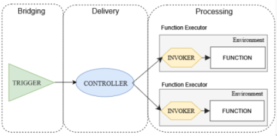

### Trigger

- Bridges external events with ones manageable by FaaS inf.
- Can convert non event-based information into events (eg. polling)
- Can handle different protocols and formats such as (HTTP,TCP, MQTTP,...)

### Controller

Interacts with external controllers to provision resources. Receive configurationfrom customer and activate workflows.

- Can deliver events with different quality of service.
- load balancing role
- asynch delivery

### Executor

- Invoker:
  1. Receives events from the controller
  2. runs designate function by passing it the event
  3. Manages results of execution
- Execution environment
  - Isolation (sandbox)
  - dependencies (os, lib)
  - reproduciblity
- Logic

Warm Start: the reuse of an execution environment for a function that has already been executed. This can save time and resources.

### Broker-aided Faas model

The broker-aided model introduces a message oriented middleware (MOM) for the distribution of events among Faas components.
Can also provide additional services:

- load balancing
- event filtering, and aggregation
- limits blocing operation for the container
- different delivery semantics

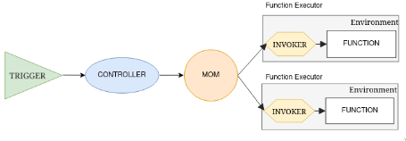

The broker can be seen as an asynchronous layer and buffer between the controller and the executor.

### function composition

Combine fucntions developed on different frameworks or languages. This can lead to an antipattern, where the **composition is too complex and the performance is degraded.**
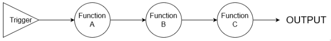

- Facade pattern: a single function that calls other functions. Useful for creating new API for mobile phones using existing services.
    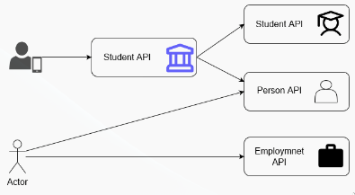
- Conditional chaining: the output of a function is the input of another
- Fan-out: a function triggers multiple functions
- Fan-in: multiple functions trigger a single function
- Scatter-gather: multiple functions are triggered and the results are aggregated (**Map-reduce**)
  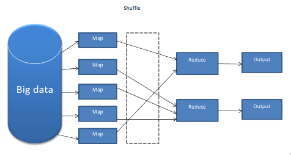

### Antipatterns

#### Function Merging Pattern

Fuction merging pattern is a way to reduce the number of functions and the number of invocations. This can be done by merging functions that are always called together.

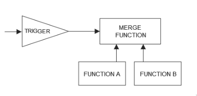

> The functions must be short living. The function merge introduces overhead, it has to wait for result. The cloud provider can optimize collapsing them in a python script and the client will stil pay for 2 separate functions.

#### Reflective invocation pattern

The customer provides a function that is called by the platform to decide which function to call. This can be used to implement a **state machine**.

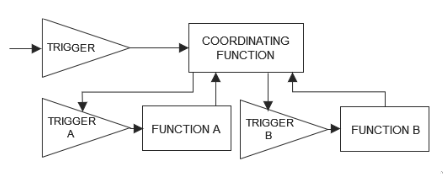

> The Coordination function is a bottleneck: forwarding to other triggers adds latency, bandwidth and cost. The coordination function is heavy and long lived, highly costly and coupled with the other functions (not reusable).

#### Continuation passing pattern

Aka function chaining, the output of a function is passed as input to another function. This can be used to implement a **pipeline**.

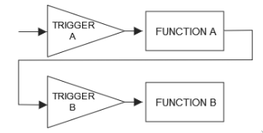

> The chain is hard coded and not reusable. The chain is not scalable and the cloud provider can optimize it by collapsing the functions in a single one since it's hard coded (and always will be).

## Hosting FaaS services

Hosting your own Faas Cloud is very expensive because there are many layers and configuration to take care of and, since it will run on low level hardware (compared with the ones provided by clouds), it will have much more latency. the cloud provider instead can share the infrastructure among many users and deployments.

### OpenFaas

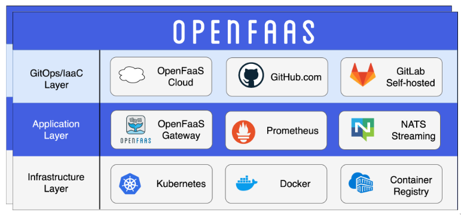

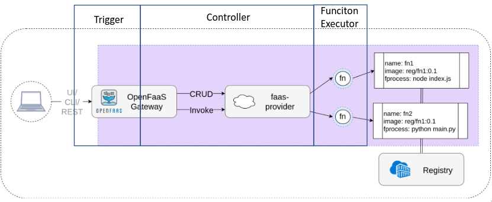

The bottleneck is the gateway scaling. The gateway is the entry point for the functions and it's hard to scale. The gateway is the one that receives the events and forwards them to the right function.
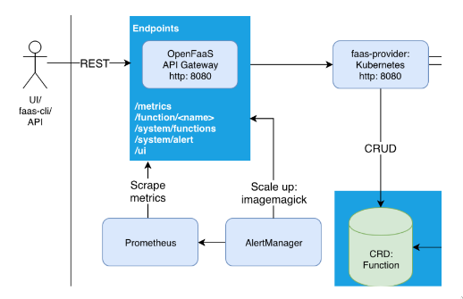

#### Nats

Nats creates a point of asynchronous communication between the controller and the invoker. The Controller doesn't stay blocked waiting for the creation of the function to deliver the request/message.

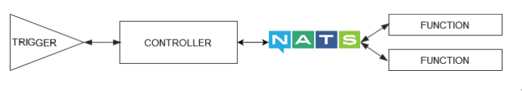

#### Watchdog

The watchdog is the invoker.

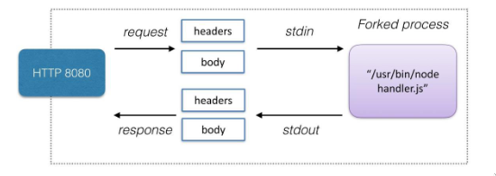

## Conclusion

All Cloud Computing models are evolving to support a wider plethora of customer needs. Tailoring a model to support a use case it wasn't designed for has some consequences. Choosing the right Cloud Computing model depends on many factors and requires an expert engineer.