# Global Stream Processing

Stream can't work batch. MapReduce will give data after the second phase is completely finished, long delay to get data. Stream uses dataflow solution, pipelines through nodes. **Keep the pipe full,** but nodes are spread in a graph and not serialized as in trivial cases.

We will work asynchronously and message passing.

Most of use cases process contents of data with some time constraints:

- lantencies of few seconds
- with high throughput  

No way of using databases for storing and can't work batch: generally batch method are not intended for long-running unbounded stream-processing.

It will be effective using messages passing dataflows and MOM-like functions as connector among components. We will have **several input and several output** and we want to get a **steady input and a steady output**. Problem: mismatch velocities of output and input, inplies buffering in a queue, cost and overflow.

Using asinchronous message passing impose that we could lose something, but it should be under control and managed.

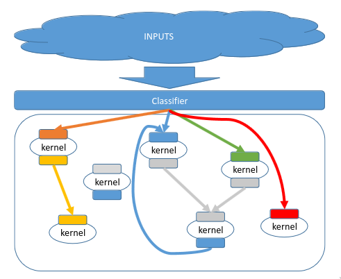

Data time locality: a delta time to process data inside the node. The nodes are in a graphs so it there can be some feedbacks. **The graph is an overlay network**. Each node produces an output.The **input and output** of a stream are **tuples**, this means that are **typed**.

## Apache Storm

Core components: typles, streams, spouts, bolts, topologies.

### Tuples

We have already seen tuples as a set of values according to some attributes, although sometimes they can miss them.

```text
<tweeter, tweet>
<URL, clicker-IP, data, time>
```

### Spout

Sequence of tuples, can be unbounded in numbers. **A Spout is a source of tuples**.

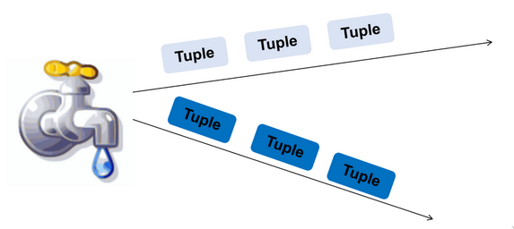

### Bolt

Bolt works on data: process input streams, output more streams for other bolts.

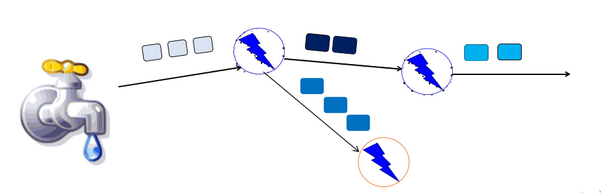

### Topology

A topology is not properly an acyclic graphs. It's directed graph of spout and bolts (and output bolts) that corresponds to a "storm application".

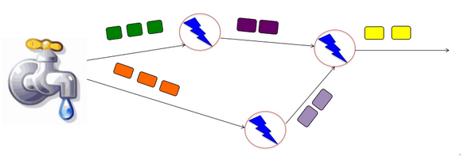

A topology defines a storm architecture that can also present cycles is the application needs them.

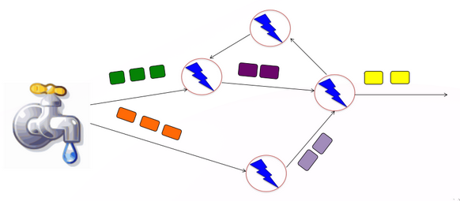

### Bolt comes in Flavors

- Filter: forward only tuples which statisfies a condition
- Joins: When receiving two streams A and B, out put all pairs (A,B) which satify a condition
- Apply/Trasform: modify each tuple according to a function

Bolts need to process a lot of data: need to make them fast. Bolt are like routers. Bolts can be grouped and queued.

### Parallelization in a Bolt

Storm provides also multiple processes ("tasks") that can constitute a bolt and incoming streams can be split among the tasks. Each incoming tuple goes to one task in the bolt.

Three types of grouping:

- Shuffle grouping: Streams are distributed evenly among the bolt tasks
- Fields grouping: Group a stream by a subset of its fiels, such as: "all tweets starting with [n-z, 5-9] goes to task 2"
- All Grouping: all tasks of bolt receive all input tuples (Usefull for joins)

### Failure behavior

Failures can be mapped: a tuple can be considered failed when its graph fails to be fully processed within a specified timeout (**time dimension**)

**Anchoring**: Anchor an output to one or more input tuples. Failure of on tuple causes one or more tuples to be replayed.

### API for fault tollerance

| api | meaning |
| --- | ------- |
| `Emit(tuple, output)` | emits a tuple with the input tuple |
| `Ack(tuple)` | ack that a bolt finisched processing a tuple |
| `Fail(tuple)` | Immediately fail the spout tuple ar the root of tuple |

Must record each ack and fail for each tuple.

## Storm architecture

Storms allows to:

1. Express your need in streaming via its components
2. configure your capacity needs over a real architecture
3. operate it over different architectures

### Storm Cluster Arch

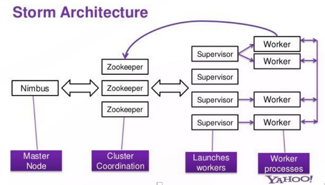

Zookepers takes care of identity of workers.

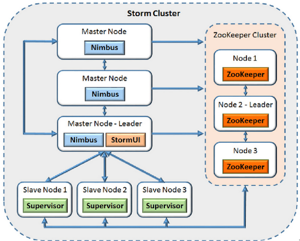

Passive replication for nimbus. Zookeper is there to take care of what's happening in the supervisors, zookeepers uses passive replication.

- Master node:
  - runs a daemon called Nimbus:
    - **distribute code around cluster**
    - assigning tasks to machines
    - monitorning for failures of machines
- Worker node
  - runs on a node (server)
  - **runs a deamon called Supervisor**
    - Listens for work assigned to its machine
    - **Runs "executors" (which contain groups of taks)**
- Zookeper:
  - **Coordinates Nimbus and supervisors communication**
  - All state of superiovisor and nimbus is kept there

### Communication in Storm

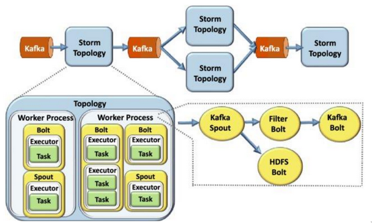

### Twitter Heron System

fixes the inefficiencies of Storm Acknowledgment system

## S4: simple scalable streaming system

- general purpose
- near real time
- disitributed
- decentralized
- scalable
- event-driven
- modular platform
- object oriented

### Architecture

S4 based on several simple components that can be put together to produce specific support. 

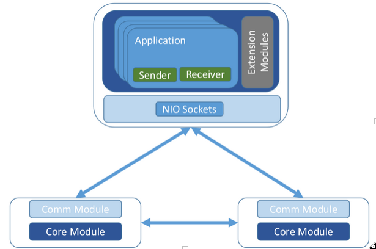

NIO sockets are the asynchronus java sockets.

### Applications

S4 os based on processing nodes to support processing elements PEs.

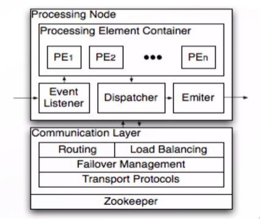

S4 works on a JVM, that  doesnt let you know the real usage od the CPU, not good. Load sharing on cluster nodes based on very simple hash functions: there is no real load balancing support.

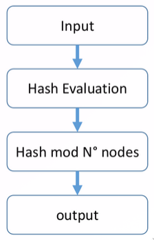

